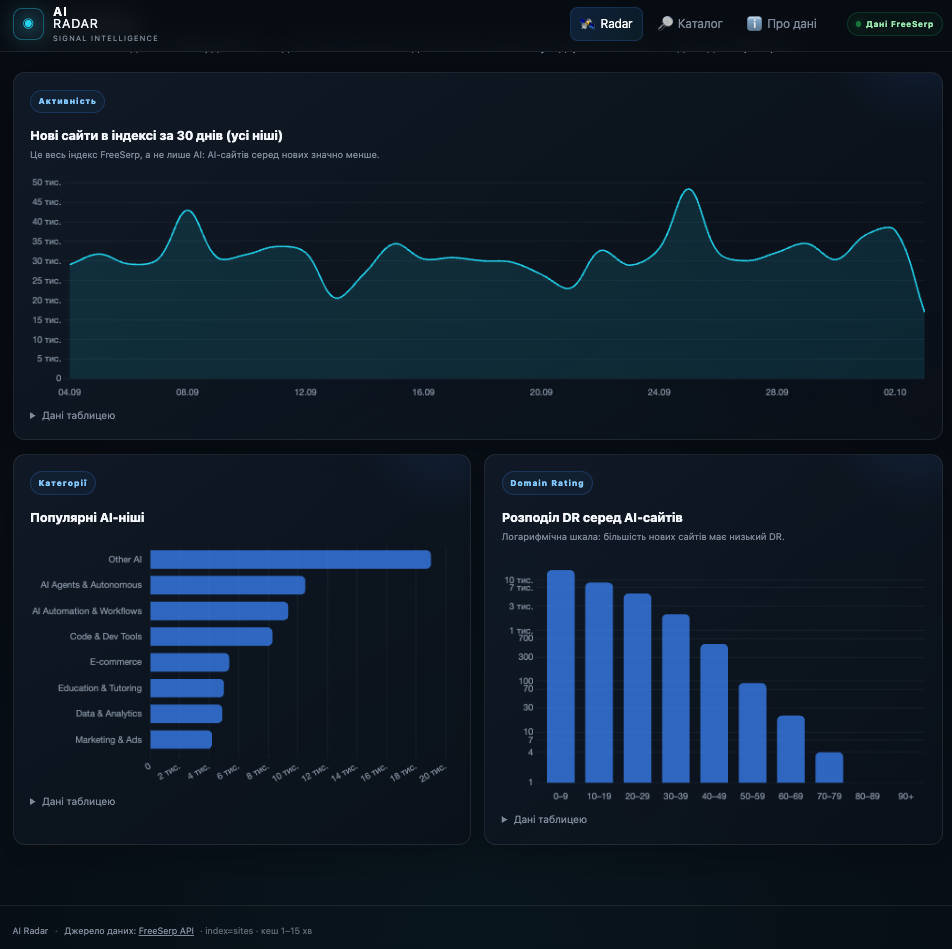
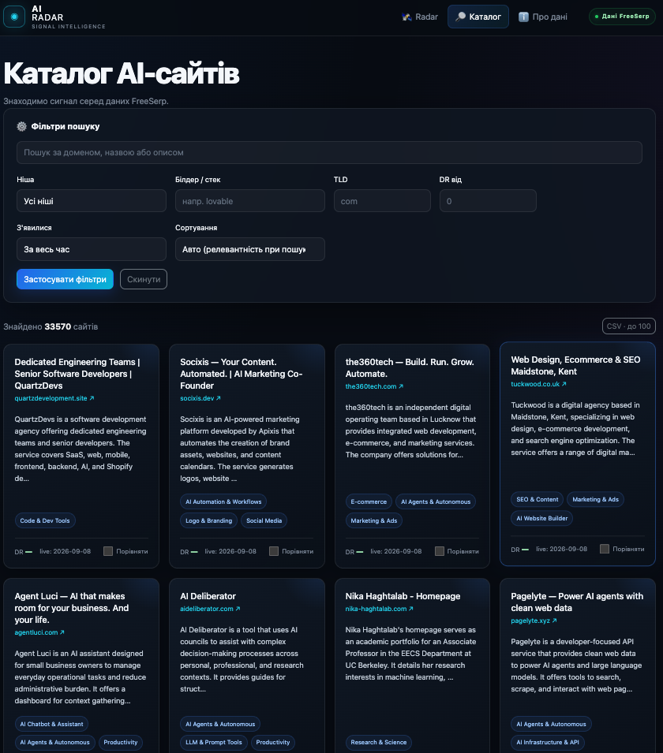
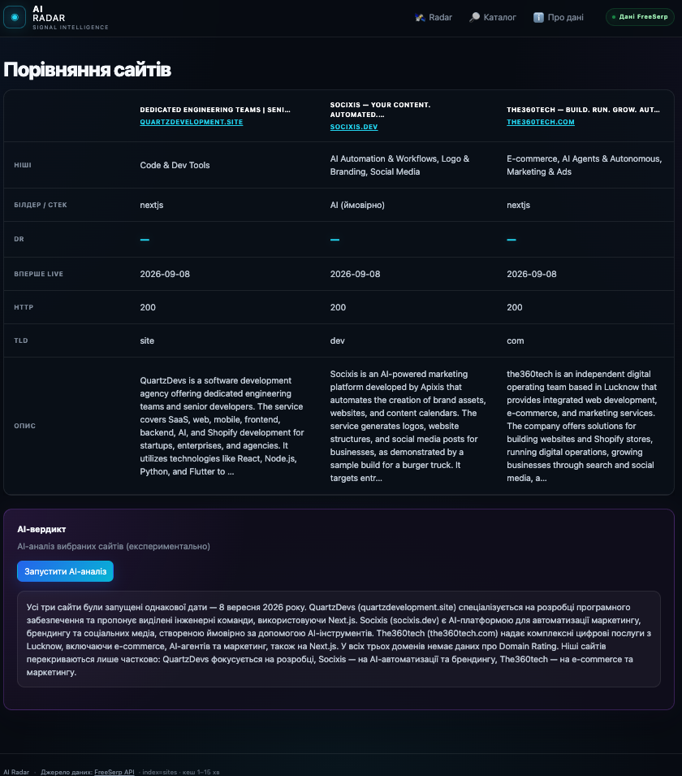

# AI Radar

Невеликий веб-застосунок для пошуку, фільтрації, порівняння та вивантаження AI-сайтів із публічного API [FreeSerp](https://freeserp.ai/docs.php) (`index=sites`, `ai_startups=1`, головні сторінки сайтів). Ключі й реєстрація не потрібні.

**Демо:** не розгорнуто (див. «Що не встиг») · **План сайту:** [`docs/site_plan.md`](docs/site_plan.md) · **Робота з AI:** [`docs/ai_process.md`](docs/ai_process.md)

## Скріншоти

| Radar (головна) | Графіки |
|---|---|
|  |  |

| Каталог із фільтрами | Порівняння та AI-вердикт |
|---|---|
|  |  |

| Про дані та обмеження |
|---|
|  |

## Що зроблено

- **Каталог** `/catalog/`: пошук, фільтри (ніша, білдер, TLD, DR від/до, період), сортування, «Показати ще», чіпи активних фільтрів, CSV до 100 рядків.
- **Radar** `/`: KPI по AI-сайтах, свіжі сайти, три графіки (нові сайти за 30 днів — весь індекс, популярні ніші, розподіл DR серед AI). Клік по стовпчику відкриває каталог із тим самим фільтром.
- **Сторінка сайту** `/site/<домен>/` зі «Схожими сайтами».
- **Порівняння** `/compare/` 2–3 сайтів; вибір зберігається між сторінками (`sessionStorage`).
- **AI-вердикт** (необов'язково, OpenRouter, безкоштовні моделі): працює лише якщо задано `OPENROUTER_API_KEYS`. Без нього решта сайту працює повністю.
- **`/about/`**: методологія й обмеження даних.

Дані динамічні: списки ніш, білдерів і TLD та межі DR-бакетів беруться з `stats=1`; безкоштовні LLM-моделі з публічного `GET /models` OpenRouter; ліміти й пресети з `.env`.

## Як запустити

Потрібен Python 3.10+ (перевірено на 3.13).

```bash
python3 -m venv .venv && source .venv/bin/activate
pip install -r requirements.txt
cp .env.example .env
python manage.py runserver
```

Відкрийте http://127.0.0.1:8000/. База даних не потрібна.

Режим, близький до production:

```bash
export DEBUG=0 SECRET_KEY=<довгий-випадковий-рядок> ALLOWED_HOSTS=localhost,127.0.0.1
python manage.py collectstatic --noinput
gunicorn config.wsgi:application      # налаштування в gunicorn.conf.py (timeout 60 с)
```

Перевірки: `python manage.py check && python manage.py test` (90 тестів, мережа не потрібна). Деталі: [`docs/local_checks.md`](docs/local_checks.md).

## Використання API FreeSerp

| Задача | Параметри |
|---|---|
| Каталог, свіжі, схожі | `index=sites`, `ai_startups=1`, `size`, `from`, `sort`, `order` |
| Пошук | `q` |
| Фільтри | `ai_categories`, `ai_source`, `tld`, `dr_min`, `dr_max`, `from_date` |
| Сторінка сайту, порівняння | `q=<домен>`, `all=1` |
| Статистика, списки фільтрів | `stats=1` |
| AI-показники (+7/30 днів, DR по AI) | запити з `size=1`, береться лише `total` |

Тільки `radar/services/freeserp.py` знає формат API; views і шаблони працюють із dataclass-ами з `schemas.py`. Агрегати `by_day` і `dr.histogram` у `stats=1` стосуються всього індексу, тому в інтерфейсі підписані окремо.

## Налаштування

Усе через `.env` (шаблон `.env.example`). Повна таблиця змінних, static files і розгортання: [`docs/configuration.md`](docs/configuration.md).

## Обмеження даних

- Дані автоматичні й «шумлять»; `went_live` — це перша перевірка, коли сайт відповів, а не дата запуску.
- AI-класифікація FreeSerp може відставати від індексу: на головній показано, скільки днів тому з'явився найсвіжіший AI-сайт, і пресет «7 днів» інколи порожній.
- `from + size` не більше 10 000 (обмеження API).
- Кеш `LocMemCache` не спільний між воркерами Gunicorn. Для демо цього досить.

## Що не встиг

- Демо не розгорнуто (підходить Render/Railway: build `pip install -r requirements.txt && python manage.py collectstatic --noinput`, start `gunicorn config.wsgi:application`).
- Немає JS-тестів; адаптив перевірено лише в DevTools.
- AI-вердикт залежить від доступності безкоштовних моделей, відповідь може йти до ~45 с.

## Що доробив би

- Єдиний реєстр полів і фільтрів (один опис → форма, URL, чіпи, CSV, порівняння).
- Сортування з `?help=1` замість трьох зашитих варіантів; лічильники в списках фільтрів.
- Збереження знімків статистики для справжніх AI-трендів (`to_date`-вікна).
- Redis-кеш, CSP, метрики latency/помилок для FreeSerp і OpenRouter.
