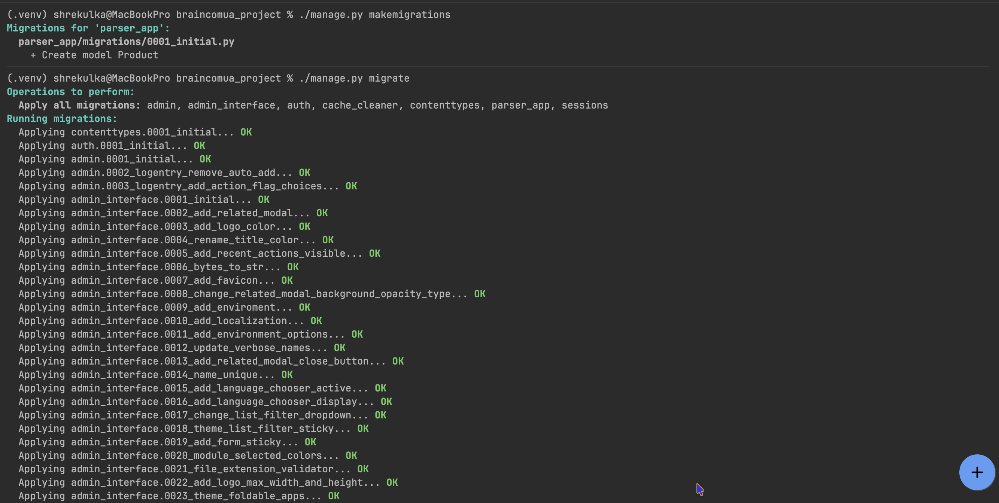
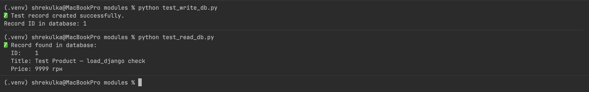
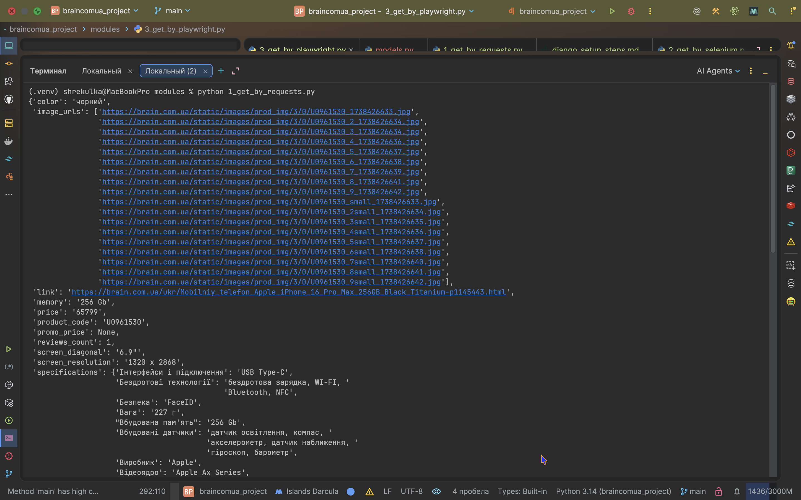
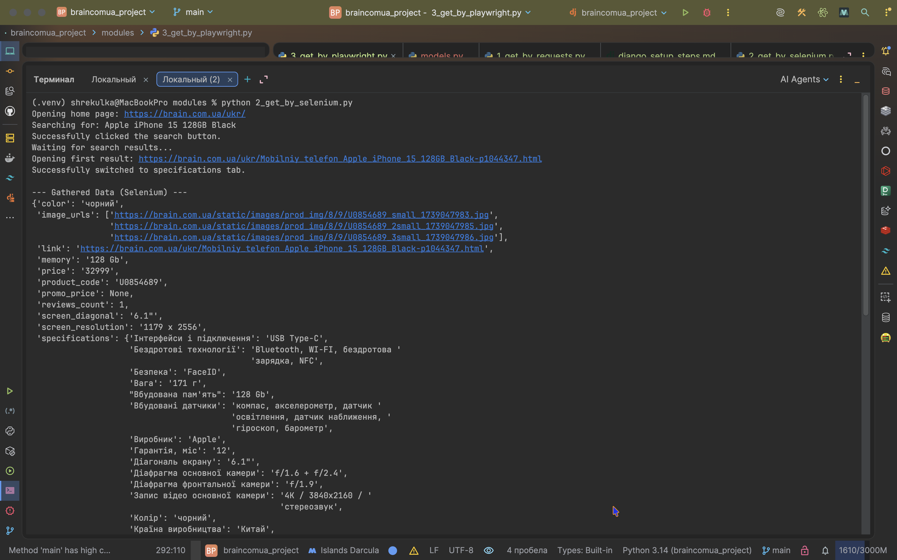
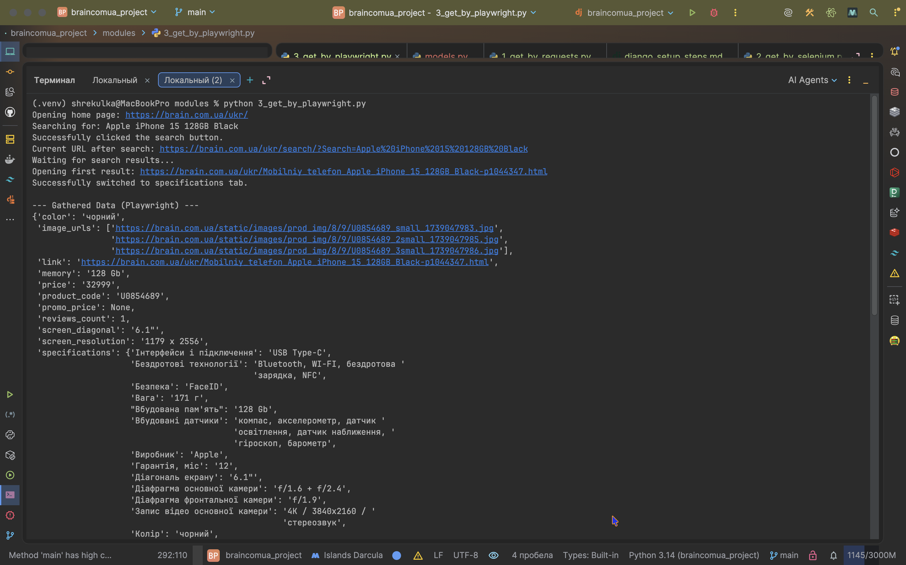
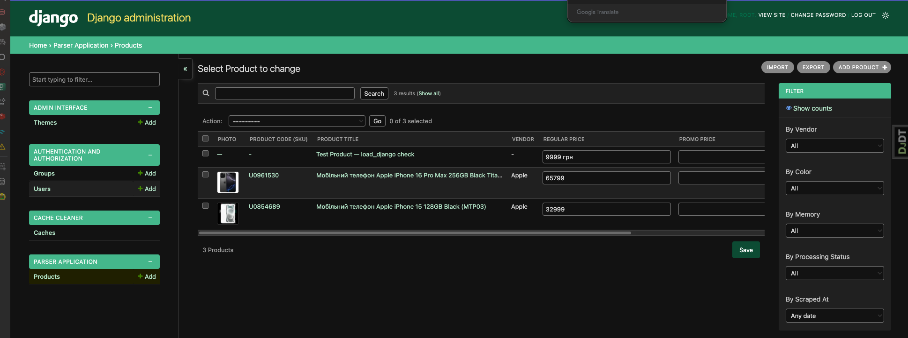
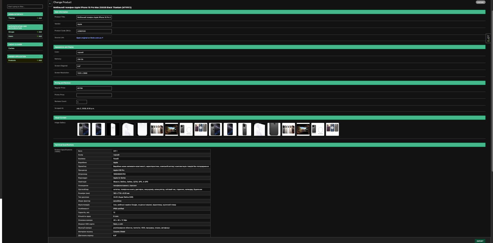
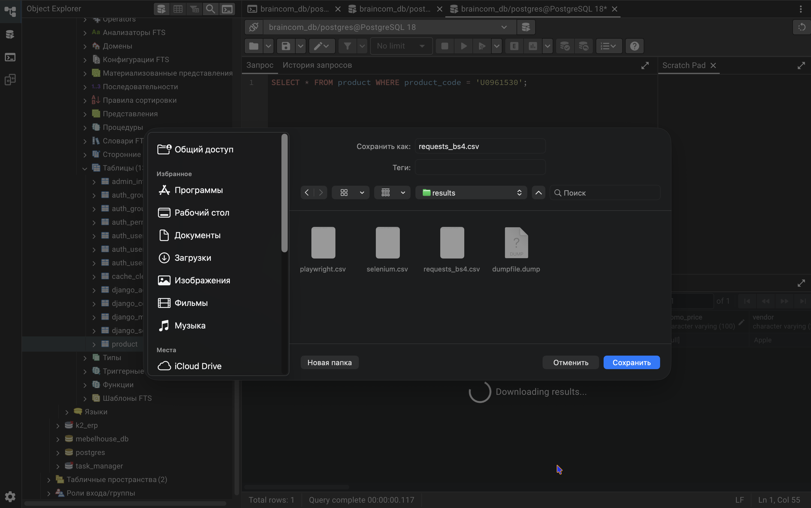

# 🛠️ Django Project Deployment Guide (Setup in 5–10 Minutes)

This document is a **step-by-step technical guide**: it walks through deploying the project from scratch — setting up the environment, initializing the database, verifying that the Django ORM bridge works, running the three scrapers, exporting the collected data, and using the customized admin panel.

> 📌 **New here?** If you just want to understand *what this project is and why it exists*, read [`README.md`](./README.md) first — it explains the purpose of the project in plain language. This document (`django_setup_steps.md`) is the technical "how to run it" companion to that overview.

---

## 📁 Project Structure

The folder structure and file naming conventions follow the company's internship guidelines: the root folder is named after the target domain with a `_project` suffix, and all scraper/utility scripts live inside a dedicated `modules/` folder, isolated from the Django app itself.

```text
📁 braincomua_project/                # Root directory (domain_project)
├── 📁 config/                        # Global Django configuration files
│   ├── 📄 settings.py                # Environment-ready settings (.env integration)
│   └── 📄 urls.py                    # Customized routing & English Admin headers
├── 📁 docs/                          # Documentation assets
│   └── 📁 images/                    # Verification screenshots
├── 📁 modules/                       # Independent parsing and utility scripts
│   ├── 📄 1_get_by_requests.py       # Static requests-based scraper (Requests + BS4)
│   ├── 📄 2_get_by_selenium.py       # Alternative Selenium-based parser
│   ├── 📄 3_get_by_playwright.py     # Alternative Playwright-based parser
│   ├── 📄 load_django.py             # Standalone Django ORM initialization bridge
│   ├── 📄 test_read_db.py            # Auxiliary script to verify DB read
│   ├── 📄 test_write_db.py           # Auxiliary script to verify DB write
│   └── 📄 utils.py                   # Reusable string and price cleanup helpers
├── 📁 parser_app/                    # Core Django application
│   ├── 📄 admin.py                   # Customized English admin interface
│   ├── 📄 apps.py                    # Application configuration (English verbose name)
│   └── 📄 models.py                  # Standard Product database model
├── 📁 results/                       # Target data export directory
│   ├── 📄 dumpfile.dump              # PostgreSQL binary backup (database dump)
│   ├── 📄 playwright.csv             # Exported Playwright parser CSV (via pgAdmin)
│   ├── 📄 requests_bs4.csv           # Exported Requests parser CSV (via pgAdmin)
│   └── 📄 selenium.csv               # Exported Selenium parser CSV (via pgAdmin)
├── 📄 .env.example                   # Environment variables template
├── 📄 manage.py                      # Django management execution script
├── 📄 requirements.txt               # Frozen project dependencies file
├── 📄 django_setup_steps.md          # Step-by-step deployment guide (this file)
└── 📄 README.md                      # Project overview — read this one first
```

💡 **Why this structure matters:** keeping scrapers in `modules/` separate from the actual Django app (`parser_app/`) means the scraping scripts can be run as plain, independent Python files — you don't need to start a Django server or go through a web view to run them. `load_django.py` is the small "bridge" that lets a standalone script outside the Django project still use Django's database models (more on this in step 5).

---

## 1. Environment Setup

Run the following commands in your terminal to create an isolated Python environment and install all required libraries:

```bash
# Create virtual environment
python3 -m venv .venv

# Activate environment (macOS/Linux)
source .venv/bin/activate

# Activate environment (Windows PowerShell)
.venv\Scripts\Activate.ps1

# Upgrade pip package manager
pip install --upgrade pip

# Install all project dependencies (including DBMS connectors, scrapers, and UI themes)
pip install -r requirements.txt

# Install Chromium for the Playwright library
playwright install chromium
```

💡 **What's happening here, step by step:**
- `python3 -m venv .venv` creates a **virtual environment** — an isolated folder with its own Python interpreter and package installations, so this project's dependencies don't clash with other Python projects on your machine.
- `source .venv/bin/activate` (or the PowerShell equivalent on Windows) "switches on" that isolated environment for your current terminal session. You'll know it worked when you see `(.venv)` appear at the start of your terminal prompt.
- `pip install -r requirements.txt` reads the list of exact package versions this project needs and installs all of them at once.
- `playwright install chromium` is a **separate, mandatory step** — Playwright itself is just a Python package, but it also needs an actual browser binary (Chromium) downloaded to your machine to be able to automate it. Skipping this step will make `3_get_by_playwright.py` fail immediately.

⚠️ Every time you open a **new** terminal window/tab to work on this project, you need to re-run `source .venv/bin/activate` — activation only applies to the current terminal session.

---

## 2. PostgreSQL Database Setup

Ensure that the PostgreSQL database service is running on your machine. Run the following SQL commands in the interactive `psql` console (or via the pgAdmin Query Tool) using a superuser account:

```sql
CREATE DATABASE braincom_db;
CREATE USER braincom_user WITH PASSWORD 'root';
ALTER DATABASE braincom_db OWNER TO braincom_user;
\c braincom_db
GRANT ALL ON SCHEMA public TO braincom_user;
```

*Note: By default, the database port is set to `5432`. If your local DBMS is configured to use a different port (such as `5433`), adjust it accordingly in your `.env` configuration file.*

💡 **What's happening here, step by step:**
- `CREATE DATABASE braincom_db;` creates a brand-new, empty PostgreSQL database with this name — Django will later create tables *inside* it.
- `CREATE USER braincom_user WITH PASSWORD 'root';` creates a dedicated database user/login for this project, rather than reusing your PostgreSQL admin account — this is a standard security practice.
- `ALTER DATABASE braincom_db OWNER TO braincom_user;` makes that new user the *owner* of the database, giving it full rights over it.
- `\c braincom_db` is a `psql`-specific command that switches your current session to be *connected to* that database (needed before the next line can apply).
- `GRANT ALL ON SCHEMA public TO braincom_user;` explicitly grants permission to create tables inside the database's default schema — on newer PostgreSQL versions (15+), this permission isn't automatic even for the database owner, and skipping it causes a `permission denied for schema public` error later during migrations.

🆕 **For beginners:** if you don't have PostgreSQL installed yet, install it first (e.g. via [postgresql.org/download](https://www.postgresql.org/download/) or `brew install postgresql` on macOS), make sure the PostgreSQL service is actually running, then open a terminal and run `psql -U postgres` (or use pgAdmin's built-in Query Tool) to get an interactive prompt where you can paste the commands above.

---

## 3. Environment Variables Setup

Create a `.env` file in the root directory of the project (on the same level as the `manage.py` file) and populate it with the following configuration variables:

```env
# Django Settings
SECRET_KEY=django-insecure--sdgsbgksdtgustghusghndkesfgrgaegw35ges5hgbdfxggq2e3raw4t
DEBUG=True
ALLOWED_HOSTS=localhost,127.0.0.1
CSRF_TRUSTED_ORIGINS=http://localhost:8000,http://127.0.0.1:8000

# Database Configuration (PostgreSQL)
DB_ENGINE=postgresql
POSTGRES_DB=braincom_db
POSTGRES_USER=braincom_user
POSTGRES_PASSWORD=root
DB_HOST=localhost
DB_PORT=5432
```

💡 **Why a `.env` file, instead of just writing these values into `settings.py`?**
A `.env` file keeps secrets (passwords, keys) and environment-specific values (database host, debug mode) *out* of the actual source code. This means:
- The same codebase can run with different settings on your laptop vs. a production server, just by using a different `.env` file — no code changes needed.
- Sensitive values like `SECRET_KEY` and database passwords never get accidentally committed to git and exposed publicly.

⚠️ **Important:** never commit your real `.env` file to version control. Only a `.env.example` file (with placeholder/fake values, like the one already included in this repository) should be tracked by git. Add `.env` to your `.gitignore` if it isn't there already.

---

## 4. Database Initialization and Admin User Creation

Generate the migration files for the scraper application, apply the schema to the PostgreSQL database, and create an administrator account to access the Django Admin panel:

```bash
# Generate migration files for the application models
python manage.py makemigrations parser_app

# Apply database schema migrations
python manage.py migrate

# Create superuser (administrator)
python manage.py createsuperuser
```

💡 **What's happening here, step by step:**
- `makemigrations parser_app` looks at the `Product` model defined in `parser_app/models.py` and generates a set of instructions (a "migration file") describing what database table structure is needed to store it.
- `migrate` actually applies those instructions to your PostgreSQL database — this is the step that physically creates the `product` table (and Django's own internal tables) inside `braincom_db`.
- `createsuperuser` creates a login account for the Django Admin panel (`/admin/`). You'll be prompted interactively for a username, email, and password.

🆕 **For beginners:** `makemigrations` and `migrate` are two separate, always-paired steps in Django — the first one *writes* the plan, the second one *executes* it against the actual database. You'll re-run both any time you change a model field in the future.

---

## 5. Verifying `load_django.py` (ORM Bridge Testing)

Before running the main scrapers, verify that the connection between the Django ORM and the standalone scripts in the `modules/` directory is properly configured.

Navigate to the `modules/` directory and run the two verification scripts:

```bash
cd modules

# 1. Script writes a test product to the database
python test_write_db.py

# 2. Script reads this product and prints it to the console
python test_read_db.py
```

If the details of the test product along with its ID are printed to the console, the integration is working correctly.

💡 **Why does this step exist, and what problem does it prevent?**
The scraper scripts (`1_get_by_requests.py`, etc.) live in `modules/`, *outside* the actual Django project folder — they're not run through `manage.py`, so Django doesn't automatically know about its own settings or models when one of these scripts starts. `load_django.py` manually points Python to the project's settings file and calls `django.setup()`, effectively "waking up" Django inside a plain script.

This two-script test exists because this exact connection is one of the most common failure points for newcomers: it's easy to get the file paths wrong inside `load_django.py`, and the error messages Django gives in that case can be confusing. Running `test_write_db.py` followed by `test_read_db.py` gives an immediate, clear yes/no answer — *before* you spend time debugging a real scraper and wondering whether the bug is in your parsing logic or in this underlying connection.

---

## 6. Running the Scrapers

All scrapers are independent, alternative solutions and are executed individually from the `modules/` folder while the virtual environment is active:

```bash
# Scraper #1: Requests + BeautifulSoup4 (direct collection of iPhone 16 Pro Max)
python 1_get_by_requests.py

# Scraper #2: Selenium (search and collection of iPhone 15 128GB Black)
python 2_get_by_selenium.py

# Scraper #3: Playwright (search and collection of iPhone 15 128GB Black)
python 3_get_by_playwright.py
```

💡 **What to expect when running each one:**
- `1_get_by_requests.py` finishes almost instantly — it's just an HTTP request and HTML parsing, no browser involved.
- `2_get_by_selenium.py` will briefly open (or run invisibly, depending on configuration) an actual Chrome browser window, perform a search, click a result, and close itself.
- `3_get_by_playwright.py` runs the same search-and-click scenario, but headless (no visible window) by default, using the Chromium binary installed back in step 1.

Each script prints the collected data to the console (via `pprint`) before saving it, so you can visually verify the result is correct before it's written to the database.

---

## 7. Django Admin Customization and Additional Features

As part of the project, modifications and customization were implemented on the standard Django interface to tailor it to scraping workflows (with all text and actions translated into English):

* **Custom Headers** (`config/urls.py`): Instead of default Django text, the header displays `"Parser Administration Panel"`, and the browser tab shows `"Parser Admin"`.
* **HTML Image Thumbnails** (`parser_app/admin.py`): The main product list view features a column displaying a thumbnail of the product photo (`image_thumbnail`).
* **HTML Gallery and Specifications Table** (`parser_app/admin.py`): On the product detail view, the list of links is rendered as an interactive preview gallery, and technical specifications are structured in a clean HTML table (`specs_table`).
* **Custom JSON Widget** (`parser_app/admin.py`): For editing raw JSON fields (`image_urls`, `specifications`), a widget with support for 4-space indentation and unescaped Cyrillic characters is integrated, making manual data adjustments more convenient.
* **Bulk Actions**: A custom action `reset_reviews_count` has been added to reset the review count for selected products in a single click.
* **Export Plugin Integration**: Integrated `django-import-export` to allow administrators to test exporting data.

💡 **How to see this in action:** after running `python manage.py runserver`, open `http://127.0.0.1:8000/admin/` in your browser and log in with the superuser account created in step 4. Click into the `Products` section to see the customized list view and detail page described above.

---

## 8. Creating a Database Dump (PostgreSQL)

To save the scraped results as a database backup (a requirement for the `results/` folder), execute the following dump export command in the terminal:

```bash
pg_dump -U braincom_user -h localhost -p 5432 -d braincom_db -F c -b -v -f results/dumpfile.dump
```

💡 **What this command does:** `pg_dump` creates a complete, portable backup of the entire `braincom_db` database in PostgreSQL's custom binary format (`-F c`), including large objects (`-b`), with verbose progress output (`-v`), saved to `results/dumpfile.dump`. This single file can later be used to fully restore the database on another machine via `pg_restore`.

---

## 9. Exporting Results to CSV via pgAdmin

According to the specifications, exporting the gathered data to CSV format is handled using the built-in database tools within the pgAdmin interface (without writing custom Python export scripts):

1. Open pgAdmin and connect to the `braincom_db` database.
2. Open the **Query Tool** (`Alt+Shift+Q`) to execute SQL queries.
3. To retrieve the `requests_bs4.csv` file, execute the following query:
```sql
   SELECT * FROM product WHERE product_code = 'U0961530';
```
   In the query results pane, click the **Download as CSV** button (the down-arrow icon) and save the file to `results/requests_bs4.csv`.
4. To retrieve the `selenium.csv` and `playwright.csv` files, execute the following query:
```sql
   SELECT * FROM product WHERE product_code = 'U0854689';
```
   Download the results and save them twice under their respective names in the `results/` folder.

💡 **Why filter by `product_code` instead of exporting the whole table?** Each `product_code` corresponds to a specific phone that was scraped by a specific script (`U0961530` = iPhone 16 Pro Max, collected by `1_get_by_requests.py`; `U0854689` = iPhone 15, collected by both `2_get_by_selenium.py` and `3_get_by_playwright.py`). Filtering this way produces a clean, single-row CSV file per scraper run, making it easy to verify which script produced which result.

---

## 📸 Screenshot Checklist (for the instructor)

To verify successful completion of the tasks, visual confirmations of the key stages have been added to the `docs/images/` folder:

1. **Database Initialization Stage**: A screenshot showing the successful application of migrations in the terminal (`python manage.py migrate`).

   

2. **load_django Verification Stage**: A screenshot showing the successive execution of the `test_write_db.py` and `test_read_db.py` utilities.

   

3. **Scrapers Execution Stage**: A screenshot of the terminal displaying logs of data collection without warnings or errors.

   

   

   

4. **Admin Panel Demonstration Stage**: A screenshot of the custom Django Admin panel showing the product list view, image thumbnails, and the expanded specifications section.

   

   

5. **pgAdmin Stage**: A screenshot of the pgAdmin Query Tool window showing the executed SQL query and the highlighted *Download as CSV* button.

   