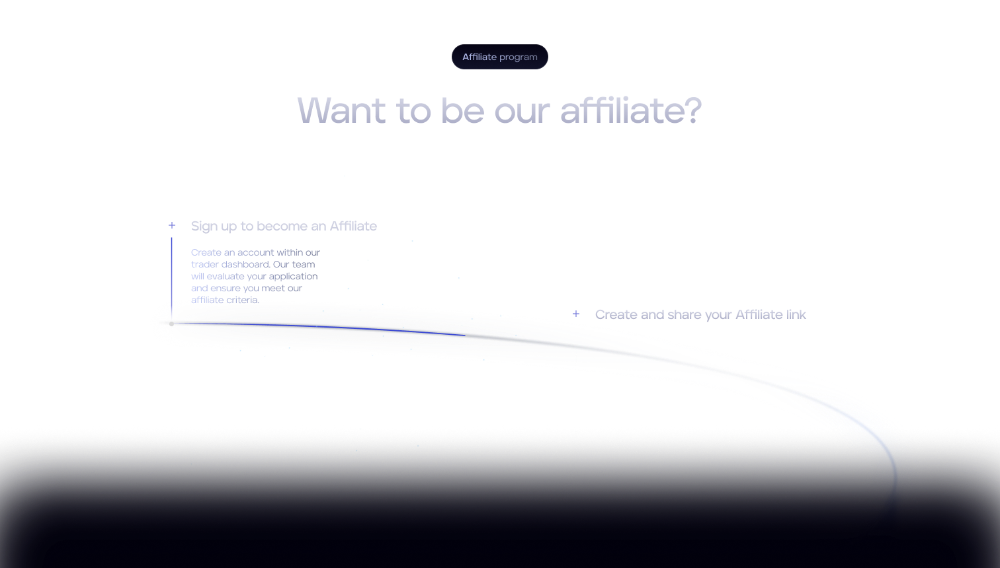
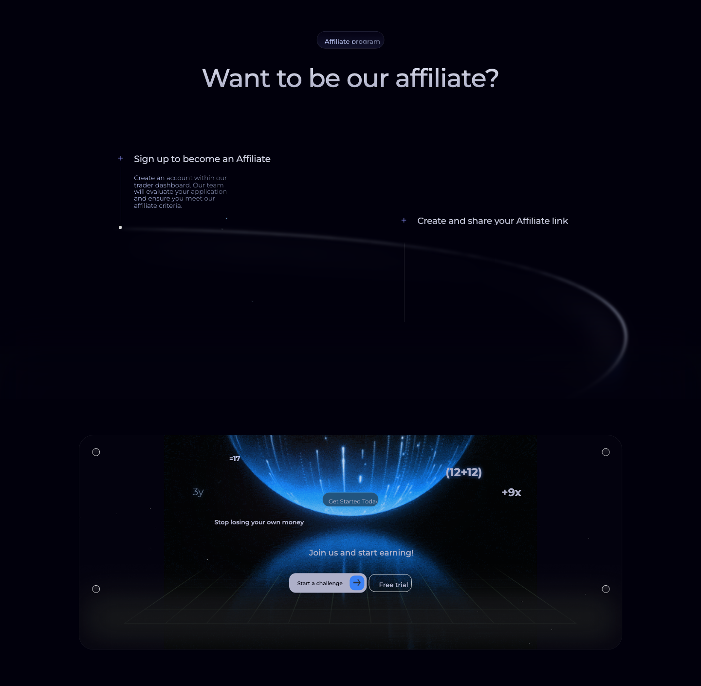
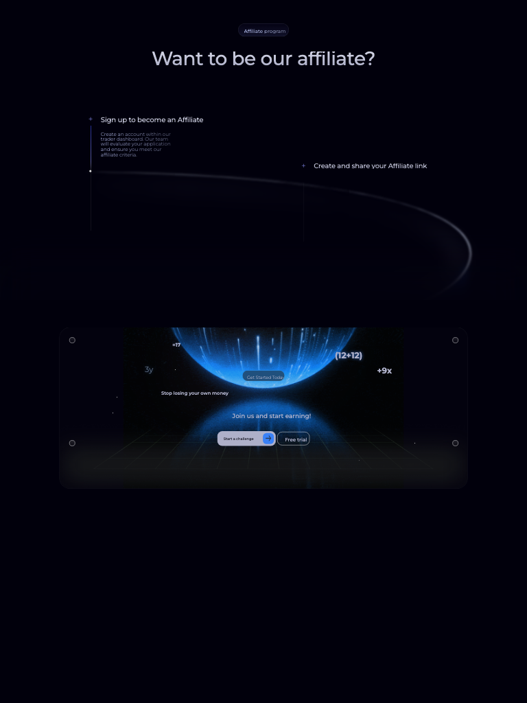
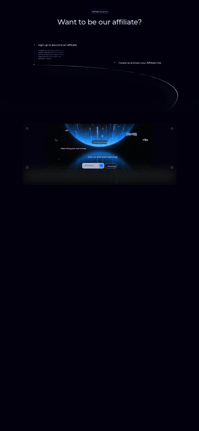
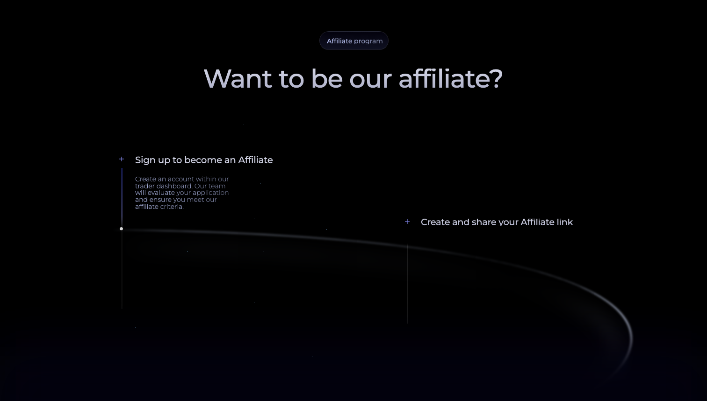
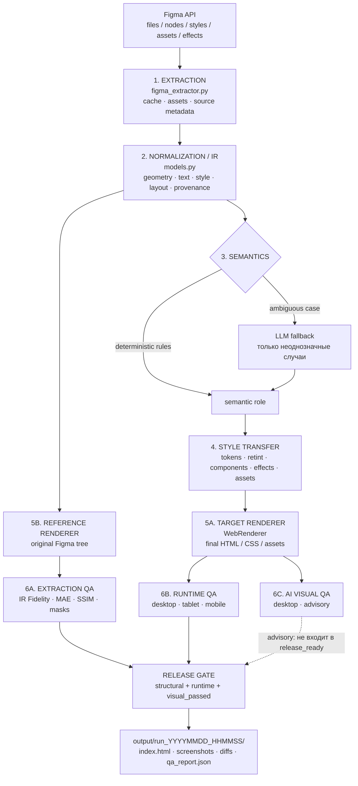
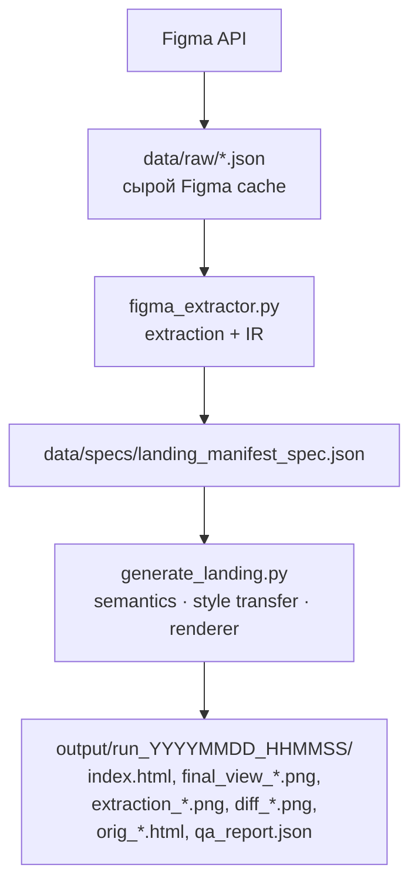
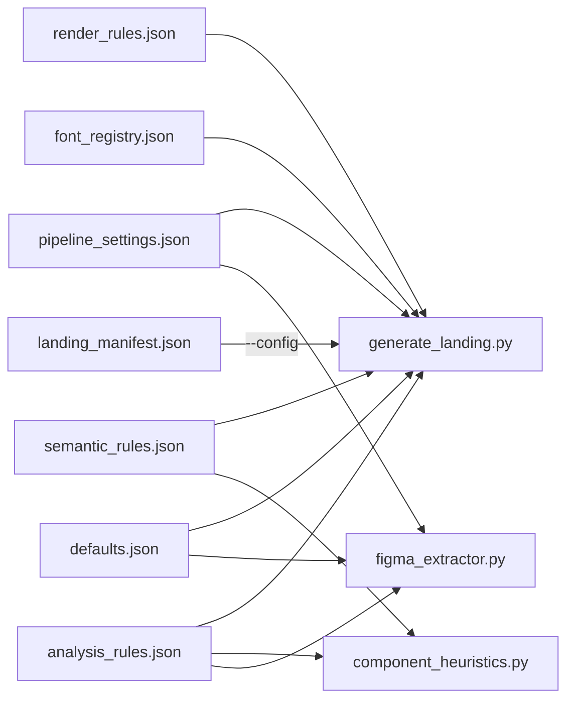
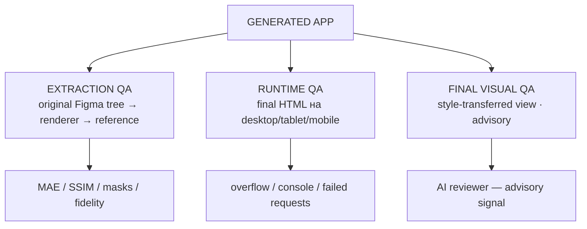
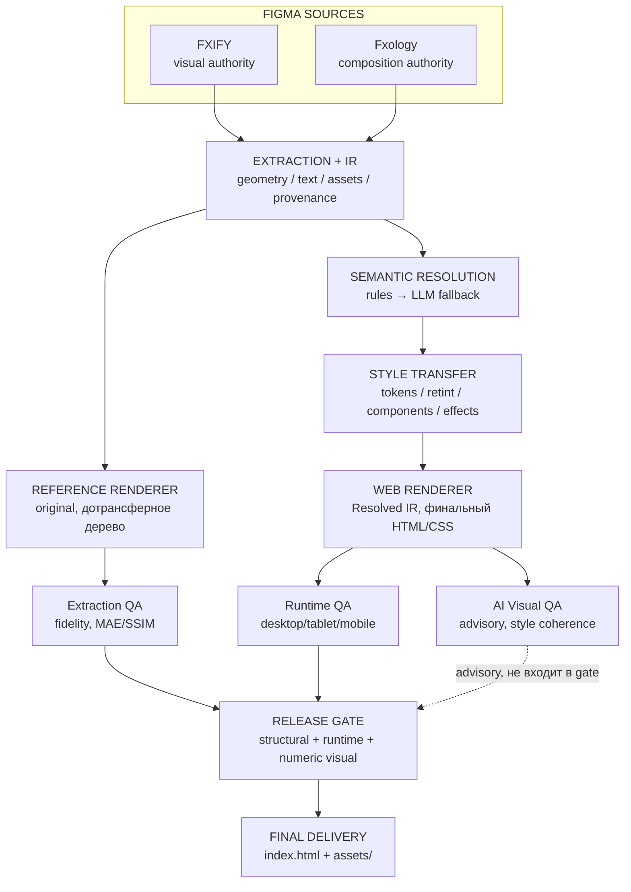

# Figma Style Transfer & Landing Generator

> **Figma → Extraction → IR → Semantic Resolution → Style Transfer → Renderer → QA → Delivery**

Универсальный Python-пайплайн для программного извлечения UI из Figma, переноса визуального языка одной дизайн-системы на композицию другой и сборки результата в готовый HTML/CSS-интерфейс.

Проект построен вокруг принципа **разделения источников истины**:

- **Fxology** отвечает за композицию и исходный контент.
- **FXIFY** отвечает за визуальный язык и design tokens.
- **Python** выполняет всю точную и воспроизводимую работу.
- **AI** используется точечно — для неоднозначной семантики и дополнительной визуальной оценки финального результата.

---

## 📌 Содержание

| Раздел | Что внутри |
|---|---|
| [1. Что делает система — за 1 минуту](#-1-что-делает-система--за-1-минуту) | TL;DR, формула задачи, вход/выход |
| [2. Задача и Design Contract](#2-задача-и-design-contract) | Формальная постановка, источники, терминология |
| [3. Что именно совмещается](#3-что-именно-совмещается) | Что от FXIFY, что от Fxology, что запрещено |
| [4. Визуальный результат](#4-визуальный-результат) | Скриншоты источников, финала, responsive, extraction fidelity |
| [5. Архитектура](#5-архитектура) | Логическая схема, два render-пути, файловый маршрут |
| [6. Основные компоненты кода](#6-основные-компоненты-кода) | Ответственность каждого файла |
| [7. Code vs AI](#7-code-vs-ai--строгое-разделение-ответственности) | Что делает код, где нужен AI |
| [8. AI-модели](#8-ai-модели-и-режим-работы-без-платного-api) | Бесплатные endpoints, AI workloads |
| [9. Конфигурация](#9-конфигурация-configs) | Config Usage Map, полная таблица |
| [10. Переменные окружения](#10-переменные-окружения) | `.env`, Environment Validation Matrix |
| [11. Запуск](#11-запуск--подробно-с-объяснением-каждой-команды) | Все команды с объяснением каждой |
| [12. Контроль качества](#12-контроль-качества) | Extraction / Runtime / Numeric / AI Visual QA |
| [13. Как читать qa_report.json](#13-как-читать-qa_reportjson) | Формула `release_ready` |
| [14. Responsive и другие платформы](#14-responsive-и-другие-платформы) | Текущая поддержка, renderer-адаптеры |
| [15. Технические особенности](#15-технические-особенности-которые-важно-понимать) | Retint, sampling, шрифты, ELLIPSE, effects, assets |
| [16. Model / IR / Provenance](#16-model--ir--provenance) | Термины, происхождение значений |
| [17. Надёжность и воспроизводимость](#17-надёжность-и-воспроизводимость) | Архитектурные принципы reliability + таблица «Гарантируется / Не гарантируется» |
| [18. Failure Modes / Troubleshooting](#18-failure-modes--troubleshooting) | Симптом → причина → проверка |
| [19. Полный рекомендуемый прогон](#19-полный-рекомендуемый-прогон) | Все команды подряд |
| [20. Полная структура проекта](#20-полная-структура-проекта) | Дерево репозитория |
| [21. Artifacts одного запуска](#21-artifacts-одного-запуска) | Что лежит в `output/run_.../` |
| [22. Как расширять систему](#22-как-расширять-систему) | Новый source / секция / роль / design system |
| [23. Известные ограничения](#23-известные-ограничения) | Честный технический долг |
| [24. Итоговая инженерная схема](#24-итоговая-инженерная-схема) | Полная картина от источников до релиза |
| [25. Финальная модель проекта](#25-финальная-модель-проекта) | Главный тезис |

---

## ⚡ 1. Что делает система — за 1 минуту

### Главная идея

> 🏷️ Тип схемы: **CONCEPTUAL** — кто кому принадлежит (authority), а не порядок выполнения кода.

```text
┌──────────────────────────────┐
│  Figma A — FXIFY             │
│  🎨 ВИЗУАЛЬНЫЙ ИСТОЧНИК      │
│  • palette                   │
│  • typography                │
│  • components                │
│  • radii / shadows / effects │
└──────────────┬───────────────┘
               │
               │  visual authority
               ▼
      ┌───────────────────────┐
      │   STYLE TRANSFER      │
      │   🎨 перенос языка    │
      └───────────▲───────────┘
                  │
                  │ composition + content
                  │
┌─────────────────┴─────────────┐
│  Figma B — Fxology            │
│  🧱 КОМПОЗИЦИОННЫЙ ИСТОЧНИК   │
│  • content                    │
│  • geometry                   │
│  • ordering                   │
│  • relationships              │
└───────────────────────────────┘
                  │
                  ▼
        ┌──────────────────┐
        │  FINAL UI        │
        │  ✅ единый стиль │
        └──────────────────┘
```

### Формула задачи

```text
STRUCTURE + CONTENT (Fxology)
              +
VISUAL LANGUAGE (FXIFY)
              ↓
      ЕДИНАЯ НОВАЯ СЕКЦИЯ
```

### Что получается на выходе

| Вход | Обработка | Выход |
|---|---|---|
| 🎨 FXIFY Figma | extraction design system | target tokens |
| 🧱 Fxology Figma | extraction composition | normalized IR |
| 🤖 semantic analysis | rules → LLM fallback | semantic roles |
| 🎨 target tokens + IR | style transfer | resolved IR |
| 🖥️ resolved IR | WebRenderer | `index.html` + assets |
| 🧪 HTML + references | multi-layer QA | `qa_report.json` |

---

# 2. Задача и Design Contract

## 2.1. Формальная постановка

Нужно взять две Figma-источника и собрать единый интерфейс, **не смешивая полномочия источников**.

```text
┌────────────────────────────────────────────────────────────────────┐
│                        DESIGN CONTRACT                             │
├──────────────────────────────┬─────────────────────────────────────┤
│ 🧱 COMPOSITION AUTHORITY     │ 🎨 VISUAL AUTHORITY                 │
├──────────────────────────────┼─────────────────────────────────────┤
│ Fxology                      │ FXIFY                               │
│                              │                                     │
│ • content                    │ • palette                           │
│ • ordering                   │ • typography                        │
│ • geometry                   │ • component language                │
│ • relationships              │ • radii                             │
│ • composition                │ • shadows / glow                    │
│                              │ • decorative accent language        │
└──────────────────────────────┴─────────────────────────────────────┘
```

> **Ключевой принцип:** геометрия и композиция не придумываются заново. Они приходят из Figma. AI не должен подменять Figma как source of truth.

## 2.2. Источники

| Роль | Figma source | File key | Node | Используется для |
|---|---|---|---|---|
| 🎨 Style source | FXIFY — Working file | `tIsKpTW3zj9Hg09adBX5ZH` | `1122:6758` | palette, typography, components, radii, effects |
| 🧱 Composition source | Fxology | `DOHrSfiqMosu9hdVeW6CEd` | `2196:13914` | content, geometry, ordering, relationships |

### ⚠️ Важная терминологическая деталь

В конфиге секция FXIFY называется `fxify_roadmap`, однако фактический используемый node `1122:6758` соответствует визуальному блоку Affiliate Program. Это **имя конфигурационной секции**, а не отдельный алгоритм и не special-case в renderer.

---

# 3. Что именно совмещается

## 3.1. FXIFY → что переносится как визуальный язык

| Категория | Источник |
|---|---|
| 🎨 Color tokens | FXIFY |
| 🔤 Typography language | FXIFY |
| 🧩 Component language | FXIFY |
| ◱ Radius language | FXIFY |
| 🌫️ Shadow / glow language | FXIFY |
| ✨ Accent language | FXIFY |

## 3.2. Fxology → что сохраняется как композиция

| Категория | Источник |
|---|---|
| 📝 Text/content | Fxology |
| 📐 Geometry | Fxology |
| 🧱 Layout structure | Fxology |
| 🔗 Element relationships | Fxology |
| ↕️ Ordering | Fxology |
| 🖼️ Source composition/assets | Fxology |

## 3.3. Что в финале должно быть видно

```text
┌──────────────────┐        ┌──────────────────┐
│ 🎨 FXIFY         │        │ 🧱 Fxology       │
│ visual language  │        │ composition      │
└────────┬─────────┘        └────────┬─────────┘
         │                           │
         │                           │
         └────────────┬──────────────┘
                      ▼
             ┌────────────────────┐
             │ ✅ FINAL SECTION   │
             │                    │
             │ Fxology structure  │
             │ +                  │
             │ FXIFY visual style │
             └────────────────────┘
```

## 3.4. Запрещено

| Запрещённый подход | Почему |
|---|---|
| ❌ Figma screenshot вместо реализации | получается картинка, а не интерфейс |
| ❌ ручная перерисовка Fxology с нуля | теряется исходная композиция |
| ❌ замена исходного контента | нарушается composition/content authority |
| ❌ отдельный дизайн для каждой секции | исчезает единый visual language |
| ❌ `if text == "..."` | special-case под контент |
| ❌ `if node_id == "..."` как бизнес-правило | pipeline перестаёт быть универсальным |
| ❌ hardcode конкретного RGB/позиции | перенос не масштабируется |
| ❌ использование LLM для геометрии | теряется воспроизводимость |

---

# 4. Визуальный результат

Изображения ниже — реальные артефакты проекта, а не декоративные mockups.

## 4.1. 🎨 FXIFY — visual authority



**Используется для:** palette, typography, components, radii, effects и общего visual language.

## 4.2. 🧱 Fxology — composition authority


**Используется для:** content, geometry, ordering и relationships.

## 4.3. ✅ Final — style-transferred result



Здесь должно визуально читаться следующее:

```text
Fxology composition
        │
        │ сохраняется
        ▼
┌──────────────────────────────┐
│ layout / content / geometry  │
└──────────────┬───────────────┘
               │
               │ receives FXIFY language
               ▼
┌──────────────────────────────┐
│ palette / type / components  │
│ radii / effects / accents    │
└──────────────┬───────────────┘
               ▼
       ✅ final unified UI
```

## 4.4. 📱 Responsive result

| Desktop | Tablet | Mobile |
|---|---|---|
|  |  |  |
| `1440×900` | `768×1024` | `390×844` |

**Важно:** responsive QA и final visual/style review — не одно и то же. На всех трёх viewport выполняется техническая проверка runtime; отдельная final visual review в текущей конфигурации ориентирована прежде всего на desktop.

## 4.5. 🔍 Extraction fidelity

До style transfer система умеет проверить, насколько хорошо renderer воспроизводит **исходное Figma-дерево**.

| FXIFY extraction | Fxology extraction |
|---|---|
|  |  |

Это принципиально отличается от проверки финального style-transferred screenshot:

```text
Extraction QA
Figma original tree
        ↓
ReferenceRenderer
        ↓
extraction_*.png
        ↓
MAE / SSIM / masks
```

---

# 5. Архитектура

## 5.1. Полная логическая схема

> 🏷️ Тип схемы: **LOGICAL** — что происходит с данными на каждом шаге, независимо от того, где физически лежат файлы.

Здесь намеренно показаны **два разных render-пути**. Это важно: `ReferenceRenderer` проверяет, насколько точно система воспроизводит исходное Figma-дерево, а `WebRenderer` собирает уже style-transferred результат.



### Главное различие двух renderer-путей

| Путь | Renderer | Что рендерится | Для чего нужен | Участвует в release gate |
|---|---|---|---|:---:|
| 🔍 **Reference path** | `ReferenceRenderer` | исходное Figma-дерево, **до style transfer** | Extraction / structural / numeric fidelity | ✅ |
| 🖥️ **Final path** | `WebRenderer` | `Resolved IR`, уже после style transfer | финальный HTML/CSS, responsive runtime и visual review | ✅ через runtime; AI отдельно |

> ⚠️ **Критически важно:** текущий deterministic `MAE/SSIM`-слой в первую очередь подтверждает прохождение проверок качества **извлечения и reference-rendering**, а не пиксельное сходство финального style-transferred screenshot с отдельным «идеальным финальным макетом». Для целостной проверки уже перенесённого visual language используется отдельный AI Visual QA advisory-слой.

## 5.2. Архитектура данных: физический маршрут файлов

> 🏷️ Тип схемы: **PHYSICAL** — где именно данные лежат на диске, а не что с ними происходит логически.

Это отдельная схема от логической архитектуры. Она показывает, **куда реально попадают данные**.



> 💡 Это физический маршрут данных по файловой системе — отдельная проекция от логического pipeline из 5.1: там показано, **что происходит с данными**, здесь — **где именно они лежат на диске** на каждом шаге.

### Кратко: что является источником истины на каждой стадии

| Стадия | Source of Truth |
|---|---|
| До extraction | Figma |
| После extraction | Figma data → IR |
| Во время semantic resolution | IR + semantic rules |
| Во время style transfer | IR + target design tokens |
| Во время rendering | Resolved IR |
| При QA | соответствующий reference + runtime facts |
| Для delivery | `index.html` + `assets/` |

---

# 6. Основные компоненты кода

| Файл | Ответственность | Что не должен делать |
|---|---|---|
| `scripts/figma_extractor.py` | Figma API, extraction, normalization, assets | не генерирует финальный HTML |
| `scripts/models.py` | IR / Pydantic-модели | не должен содержать page-specific business rules |
| `scripts/component_heuristics.py` | deterministic semantic classification | не должен вручную назначать geometry |
| `scripts/color_resolution.py` | color parsing, token resolution, retint | не должен знать конкретные node ids |
| `scripts/generate_landing.py` | orchestration, renderer, QA runtime | не должен становиться набором special-case под одну страницу |
| `scripts/ir_fidelity.py` | structural/reference fidelity | не отвечает за AI semantic reasoning |
| `scripts/paths.py` | centralized paths | не содержит UI logic |
| `scripts/utils.py` | общие вспомогательные функции | не должен становиться «свалкой» page-specific правил |
| `check_mask.py` | diagnostic inspection raw Figma JSON | не является частью release pipeline |

---

# 7. Code vs AI — строгое разделение ответственности

## 7.1. Что делает код

```text
┌──────────────────────────────────────────────────────┐
│                  DETERMINISTIC LAYER                 │
├──────────────────────────────────────────────────────┤
│ ✅ Figma extraction                                  │
│ ✅ Geometry / coordinates                            │
│ ✅ IR normalization                                  │
│ ✅ Color parsing / HSL math                          │
│ ✅ Design token mapping                              │
│ ✅ Asset retint                                      │
│ ✅ Shadow / glow retint                              │
│ ✅ HTML/CSS rendering                                │
│ ✅ Responsive behavior                               │
│ ✅ Runtime checks                                    │
│ ✅ Numeric visual QA                                 │
└──────────────────────────────────────────────────────┘
```

## 7.2. Где нужен AI

```text
┌──────────────────────────────────────────────────────┐
│                       AI LAYER                       │
├──────────────────────────────────────────────────────┤
│ 🤖 Semantic classification fallback                  │
│    когда deterministic rules неоднозначны            │
│                                                      │
│ 👁️ AI Visual QA                                      │
│    анализ финального screenshot целиком              │
│    и поиск визуально «чужих» source-style accents    │
└──────────────────────────────────────────────────────┘
```

## 7.3. Что AI намеренно НЕ делает

| Область | AI? | Причина |
|---|:---:|---|
| Геометрия | ❌ | должна быть воспроизводимой и приходить из Figma |
| Точные RGB-значения | ❌ | есть deterministic color math |
| HSL / hue rotation | ❌ | алгоритмически вычисляется |
| Layout | ❌ | определяется исходной композицией |
| Rendering | ❌ | делает renderer |
| Source of Truth | ❌ | остаётся Figma |
| Semantic fallback | ✅ | здесь нужна интерпретация |
| Visual coherence review | ✅ | здесь полезно целостное визуальное восприятие |

---

# 8. AI-модели и режим работы без платного API

```text
CURRENT ARCHITECTURE
    AI backend заменяем: core pipeline не зависит от конкретной модели

VERIFIED RUN — semantic fallback
    nex-agi/nex-n2.5-pro:free

VERIFIED RUN — visual QA
    inclusionai/ling-3.0-flash-vl:free
```

Основной verified pipeline запускался с бесплатными OpenRouter endpoints; платный endpoint не потребовался в проверенном прогоне. Список из 19 доступных бесплатных моделей и конкретное имя модели, использованной для semantic fallback (`nex-agi/nex-n2.5-pro:free`), зафиксированы в одном конкретном прогоне — это внешний, изменяемый inventory OpenRouter, а не архитектурная гарантия того, какая именно модель будет доступна в будущем.

### Важное архитектурное правило

```text
┌─────────────────────┐
│ AI MODEL            │
│ конкретный backend  │
└──────────┬──────────┘
           │
           ▼
┌─────────────────────┐
│ AI INTERFACE        │
│ semantic / visual   │
└──────────┬──────────┘
           │
           ▼
┌─────────────────────┐
│ CORE PIPELINE       │
│ работает независимо │
│ от конкретной модели│
└─────────────────────┘
```

Поэтому замена одной free-модели на другую не должна менять geometry engine, color engine или renderer.

В verified run для Visual QA использовалась vision-language модель `inclusionai/ling-3.0-flash-vl:free`. В этой конфигурации structured-output mode был отключён (`supports_json_mode=false`), поэтому reviewer получал обычный текстовый ответ и сам разбирал JSON через `json.loads`.

### AI workloads

| AI-задача | Тип модели | Обязательность | Результат | Участвует в `release_ready` |
|---|---|:---:|---|:---:|
| Semantic classification | текстовая LLM | ◻️ fallback | semantic role / component role | ❌ |
| Final Visual QA | vision-language | ◻️ advisory | structured findings / confidence | ❌ по умолчанию |
| Geometry | deterministic code | — | координаты / размеры | — |
| Color math | deterministic code | — | tokens / hue transforms | — |
| Rendering | deterministic code | — | HTML/CSS/assets | — |

> **Архитектурный принцип:** AI является заменяемым execution backend. Основная логика проекта не должна зависеть от конкретной модели, её имени или уровня качества.

---

# 9. Конфигурация (`configs/`)

Все основные правила вынесены в JSON-конфигурацию.

## 9.1. Config Usage Map — кто читает какой конфиг

Схема ниже построена не «по смыслу», а по факту `ConfigLoader.load(...)` в каждом модуле — стрелка означает «этот конфиг читается этим модулем», направление: config → потребитель:



> ⚠️ Важно не путать со схемой в п. 5.1/5.2: `landing_manifest.json` определяет **источники и секции**, но физически читается только оркестратором (`generate_landing.py`, флаг `--config`) — `figma_extractor.py` получает node/file id не из него напрямую, а через `landing_manifest_spec.json`, который сам генерируется на основе этого манифеста. `analysis_rules.json` читается сразу тремя модулями параллельно, `semantic_rules.json` — двумя (`component_heuristics.py` и `generate_landing.py`) — то есть это не последовательная передача «один-через-другой», а параллельное использование одних и тех же файлов разными модулями.

> 📎 **`landing_manifest.json` ≠ `landing_manifest_spec.json`.** Это не два конфига одного уровня, а вход и выход одного и того же шага: `landing_manifest.json` — declarative input, который редактирует человек; `landing_manifest_spec.json` — generated нормализованный execution spec, который создаёт `figma_extractor.py` и на основании которого дальше работает `generate_landing.py` (см. физическую схему в 5.2).

## 9.2. Полная таблица конфигурации

| Config | Основное назначение | Примеры параметров |
|---|---|---|
| `landing_manifest.json` | orchestration sources/sections | file keys, node ids, modes, viewports, LLM/QA options |
| `defaults.json` | target design system | palette, typography, radius, spacing |
| `font_registry.json` | font replacement | `Aventa → Montserrat`, `PP Mori → Plus Jakarta Sans` |
| `analysis_rules.json` | extraction/analysis | background detection, accent sampling, micro-decoration thresholds |
| `semantic_rules.json` | semantic classification | regex, keywords, weights, penalties |
| `render_rules.json` | rendering rules | role → token mapping, blend modes, component thresholds |
| `pipeline_settings.json` | QA/runtime | thresholds, retries, cache retention, AI gate policy |

### Главный принцип конфигурации

```text
✅ ПРАВИЛЬНО
source role → target token → generic transformation

❌ НЕПРАВИЛЬНО
node 2196:13925 → конкретный RGB
```

---


# 10. Переменные окружения

## 10.1. Среда выполнения и верифицированная матрица

В предоставленном проектном прогоне зафиксирована следующая среда:

| Компонент | Проверенное значение | Назначение |
|---|---|---|
| 🐍 Python | `3.14.6` | выполнение pipeline и tests |
| 🧪 pytest | `9.1.1` | regression/unit tests |
| 🌐 Browser | Chromium через Playwright | screenshots, runtime QA |
| 💻 OS | macOS (`darwin`) | среда проверочного запуска |
| 🔢 Regression suite | `32 passed` | базовый regression check |
| 🖥️ Desktop viewport | `1440×900` | runtime QA |
| 📟 Tablet viewport | `768×1024` | runtime QA |
| 📱 Mobile viewport | `390×844` | runtime QA |

> Patch-версия Python указана именно как значение **проверенного запуска**, а не выводится из имени `cpython-314`.

---


Проект использует `.env` в корне.

```bash
FIGMA_TOKENS=figd_xxxxxxxxxxxxxxxx,figd_yyyyyyyyyyyyyyyy
OPENROUTER_API_KEYS=sk-or-xxxxxxxxxxxxxxxxxxxxxxxxxxxxxxxx
```

| Переменная | Обязательна | Назначение |
|---|:---:|---|
| `FIGMA_TOKENS` | ✅ | доступ к Figma API; поддерживается несколько токенов через запятую |
| `OPENROUTER_API_KEYS` | ◻️ | semantic LLM fallback и AI Visual QA |

Если `OPENROUTER_API_KEYS` отсутствует и соответствующие AI-задачи не помечены как required, deterministic часть pipeline может продолжить работу.

> 🔒 **Security hygiene.** `.env` содержит реальные секреты (`FIGMA_TOKENS`, `OPENROUTER_API_KEYS`) — не коммитить его в git, не вставлять реальные значения в README/issue/PR, добавить `.env` в `.gitignore`. Значения выше (`figd_xxxx...`, `sk-or-xxxx...`) — плейсхолдеры, а не рабочие токены.

---

# 11. Запуск — подробно, с объяснением каждой команды

## 11.1. Установка

```bash
python -m venv .venv
source .venv/bin/activate
pip install -r requirements.txt
playwright install chromium
```

### Зачем нужен `playwright install chromium`

`pip install playwright` устанавливает Python API, но браузерный бинарник Chromium скачивается отдельно. Он нужен для screenshot/render/runtime QA.

---

## 11.2. Шаг 1 — Extraction

```bash
python -m scripts.figma_extractor --force
```

### Что происходит

```text
┌──────────────────────────┐
│ Figma API                │
└────────────┬─────────────┘
             ▼
┌──────────────────────────┐
│ download / cache         │
└────────────┬─────────────┘
             ▼
┌──────────────────────────┐
│ styles / geometry /      │
│ text / assets / effects  │
└────────────┬─────────────┘
             ▼
┌──────────────────────────┐
│ normalization → IR       │
└────────────┬─────────────┘
             ▼
┌──────────────────────────┐
│ landing_manifest_spec    │
└──────────────────────────┘
```

### Зачем нужен `--force`

Без `--force` extractor может использовать локальный кэш `data/raw/*.json`. Флаг принудительно обновляет Figma-данные. Его следует использовать перед authoritative generation, когда изменились:

- Figma source;
- extraction logic;
- `models.py` / IR schema;
- extraction-related config;
- assets.

Практическое правило:

```text
изменился extraction/code
        ↓
python -m scripts.figma_extractor --force
        ↓
только потом
        ↓
python -m scripts.generate_landing
```

---

## 11.3. Шаг 2 — Генерация и QA

```bash
python -m scripts.generate_landing
```

### Что происходит

```text
┌────────────────────────────┐
│ landing_manifest.json      │
└──────────────┬─────────────┘
               ▼
┌────────────────────────────┐
│ landing_manifest_spec.json │
└──────────────┬─────────────┘
               ▼
┌────────────────────────────┐
│ Semantic rules             │
│       ↓                    │
│ LLM fallback if ambiguous  │
└──────────────┬─────────────┘
               ▼
┌────────────────────────────┐
│ Style Transfer             │
│ colors / components /      │
│ typography / effects       │
└──────────────┬─────────────┘
               ▼
┌────────────────────────────┐
│ WebRenderer                │
│ HTML / CSS / responsive    │
└──────────────┬─────────────┘
               ▼
┌────────────────────────────┐
│ Playwright QA              │
│ ├── ReferenceRenderer  →   │
│ │   Extraction / Numeric QA│
│ └── WebRenderer  →         │
│     Runtime QA + AI Visual │
└──────────────┬─────────────┘
               ▼
┌────────────────────────────┐
│ output/run_YYYYMMDD_HHMMSS│
└────────────────────────────┘
```

> ⚠️ Не путать эту упрощённую операционную схему с логической схемой из раздела 5.1: `ReferenceRenderer` получает исходное IR/оригинальное дерево **до** style transfer, тогда как `WebRenderer` получает `Resolved IR` **после** style transfer. Блок «Playwright QA» здесь показывает порядок выполнения QA в рамках одной команды, а не то, что Extraction QA получает данные от `WebRenderer` — стрелка `Style Transfer → WebRenderer` на схеме описывает только последовательность запуска, а не источник данных для Extraction QA.

Каждый запуск создаёт отдельный `run_*`, поэтому сравнение нескольких запусков не требует перезаписывать предыдущие результаты.

---

## 11.4. Шаг 3 — Regression tests

```bash
PYTHONPATH=. pytest tests/
```

### Зачем нужен `PYTHONPATH=.`

Тесты импортируют пакет `scripts` как часть проекта. Явный корень репозитория делает import path предсказуемым при запуске из корня.

### Набор тестов

| Test file | Проверяет |
|---|---|
| `test_clean_and_parse_json.py` | parsing/normalization ответов |
| `test_figma_gradients.py` | gradients |
| `test_generate_landing.py` | generator behavior |
| `test_gradient_text_color.py` | gradient text color |
| `test_native_mode_text_fallback.py` | native text fallback |
| `test_png_alpha_sampling.py` | alpha-aware pixel sampling |
| `test_reference_bg_detection.py` | background detection |
| `test_web_renderer.py` | renderer logic |

Подтверждённый результат тестового прогона: **32 passed**.

---

## 11.5. Шаг 4 — Диагностика raw Figma JSON

```bash
python check_mask.py
```

Это вспомогательный диагностический инструмент.

Он позволяет смотреть:

```text
Figma node
   ├── isMask
   ├── maskType
   ├── blendMode
   ├── effects
   ├── DROP_SHADOW
   └── INNER_SHADOW
```

Он не является обязательной частью build pipeline и нужен, когда необходимо объяснить конкретный rendering/effect issue непосредственно по исходному Figma JSON.

---

## 11.6. Шаг 5 — Упаковка финального результата

```bash
zip -r fxify_fxology_landing.zip \
  output/run_YYYYMMDD_HHMMSS/index.html \
  assets/
```

### Почему нельзя отправить только `index.html`

Потому что HTML использует относительные ссылки на SVG/PNG:

```html

```

Поэтому runtime delivery = `index.html` **+** `assets/` — оба, не по отдельности.

### Runtime delivery vs engineering artifacts

| Категория | Что входит |
|---|---|
| 📦 Runtime delivery | `index.html` + `assets/` |
| 🧪 QA artifacts | `qa_report.json`, screenshots, diffs |
| 🗃️ Extraction cache | `data/raw/` |
| 🧠 IR/spec | `data/specs/` |

---

# 12. Контроль качества

> 🏷️ Тип схемы: **QA** — что именно измеряется на каждом уровне, а не то, откуда берутся данные (это уже показано в 5.1).

В проекте есть **несколько разных QA-объектов**, и их нельзя смешивать.



## 12.1. Extraction QA — что именно измеряется

Проверяется fidelity **исходного Figma-дерева**, то есть до style transfer:

```text
Figma original tree
      ↓
ReferenceRenderer
      ↓
extraction_*.png
      ↓
MAE / SSIM / masks
```

Проверки включают:

- IR Fidelity;
- MAE;
- Gaussian-weighted SSIM;
- text/non-text regions;
- raster-composite regions;
- `worst_subblock` для локальных дефектов.

### Конкретный mapping текущего верифицированного прогона (`run_20260914_142910`)

Extraction QA в этом прогоне проверяла **две** IR-секции — по секциям, а не по viewport (viewport проверяет отдельно Runtime QA, см. 12.2):

| # | Секция (id манифеста) | Роль | Figma source |
|---|---|---|---|
| `[1/2]` | `fxify_roadmap` | visual authority (native mode) | FXIFY `1122:6758` |
| `[2/2]` | `fxology_features` | composition authority (style_transfer mode) | Fxology `2196:13914` |

> 📎 `render mode` в этой таблице (`native` / `style_transfer`) описывает режим **обработки конкретной секции в pipeline** для этого прогона, а не саму authority-роль из раздела 3 — не стоит читать это как «native mode = вообще не style-aware» или «style_transfer mode = единственная секция, которая style-transfer'ится».

> ⚠️ **Важный нюанс про шрифты в этой таблице.** В логе Extraction QA каждая секция при reference-рендеринге использует **свой собственный, дотрансферный** шрифт (для честного сравнения с оригинальным Figma-деревом): `fxify_roadmap` → `Montserrat` (замена Aventa), `fxology_features` → `Plus Jakarta Sans` (замена PP Mori). Это **не** финальные шрифты после style transfer — в финальном style-transferred выводе `fxology_features` наследует типографику от FXIFY, а не сохраняет свой оригинальный шрифт, иначе сама идея style transfer была бы нарушена. Два разных шрифта видны только на **reference/extraction** пути (5.1), а не на финальном экране.

## 12.2. Runtime QA — что проверяется на трёх viewport

| Viewport | Размер | Проверки |
|---|---:|---|
| 🖥️ Desktop | `1440×900` | overflow, console errors, failed requests |
| 📟 Tablet | `768×1024` | overflow, console errors, failed requests |
| 📱 Mobile | `390×844` | overflow, console errors, failed requests |

## 12.3. Numeric Visual QA — почему одна SSIM недостаточна

Система разделяет причины визуального расхождения:

| Region | Причина |
|---|---|
| 🧱 Non-text | геометрия, spacing, border, surface, grid |
| 🔤 Text | разные glyph metrics web-font и Figma font |
| 🖼️ Raster composite | разные compositing/rendering pipelines |
| 🔬 Worst subblock | локальный заметный дефект, который может раствориться в среднем значении |

Raw full-image MAE/SSIM остаются информационными. Gate опирается на специализированные значения и отдельные thresholds из `pipeline_settings.json`.

## 12.4. Final Visual QA — AI reviewer

AI reviewer получает:

```text
┌──────────────────────────────┐
│ final_view_desktop.png       │
└──────────────┬───────────────┘
               │
               ├───────────────┐
               ▼               ▼
      ┌───────────────┐ ┌────────────────┐
      │ FXIFY ref     │ │ Fxology ref    │
      └───────┬───────┘ └────────┬───────┘
              └──────────┬───────┘
                         ▼
              ┌─────────────────────┐
              │ Design Contract     │
              │ composition=Fxology │ 
              │ style=FXIFY         │
              └──────────┬──────────┘
                         ▼
              ┌─────────────────────┐
              │ AI Visual Reviewer  │
              └──────────┬──────────┘
                         ▼
              structured JSON report
```

Категории:

- `foreign_color`
- `foreign_effect`
- `foreign_asset_style`
- `overall_coherence`

### Важное правило release gate

На текущем уровне AI Visual QA — **advisory signal**: он анализирует финальный desktop screenshot, но не блокирует `release_ready`.

Точная формула deterministic release gate и смысл каждого поля приведены в следующем разделе «Как читать `qa_report.json`». AI может быть переведён в блокирующий режим позже через конфигурационную политику (`enforce`, `gate_min_confidence`, `gate_min_severity`) после отдельной калибровки false positives / false negatives.

### Почему AI Visual QA вообще нужен — а не просто «дополнительная проверка на всякий случай»

Это не риторический бонус, а структурное ограничение остальных QA-слоёв, зафиксированное прямо в docstring `AIVisualQAReviewer`:

> Advisory-слой поверх готового рендера. Работает ТОЛЬКО с финальным style-transferred скриншотом — единственным артефактом, который реально отражает post-style-transfer результат (extraction QA сравнивает **оригинальное, дотрансферное** дерево — см. `ResolvedSectionSpec.original_root` — и поэтому **в принципе не может** поймать баги retint).

> 📎 Это дословная цитата из docstring класса в коде — формулировка «единственным артефактом» технически означает «единственным артефактом, который **семантически анализируется автоматически**»: финальный HTML/CSS и `final_view_{viewport}.png` для tablet/mobile тоже отражают post-style-transfer состояние, но их структурно не читает никто, кроме этого reviewer'а (desktop-скриншот) — остальные viewport проверяются только Runtime QA (overflow/console/requests), а не семантически.

Другими словами: Extraction QA подтверждает, что *извлечение* было точным, а не что *перенос стиля* прошёл без ошибок — это структурно разные вопросы. `final_view_desktop.png` при этом существует независимо от AI и доступен для просмотра разработчику, заказчику или стороннему инструменту — правильнее сказать так: **в текущем автоматизированном pipeline AI Visual QA — единственный слой, который семантически анализирует уже style-transferred финальный скриншот**; остальные автоматические QA-слои его не касаются.

### Как reviewer отличает баг от ожидаемого поведения

Секции-получатели стиля **обязаны** визуально отличаться от своего же оригинального reference — это и есть цель style transfer, а не дефект. Промпт reviewer'а явно это оговаривает:

> НЕ считать нарушением: то, что финальный рендер секции-получателя НЕ похож на её собственный reference по цвету — так и должно быть. Флагуется только тот случай, когда в финале **остались** акценты/эффекты из оригинала секции-получателя там, где должен был примениться акцент источника стиля.

Если бы этого уточнения в промпте не было, AI reviewer систематически репортил бы «нарушение» на каждой успешно перекрашенной секции — сам факт отличия от собственного оригинала он бы принимал за ошибку.

При недоступности LLM `review()` возвращает `{"status": "not_reviewed", "reason": ...}` вместо падения пайплайна — та же схема graceful degradation, что и у `SemanticResolver.resolve_ambiguities_with_llm` (раздел 17).

### Состояния AI Visual QA и их влияние на pipeline

| Состояние | Что происходит | Влияет на `release_ready`? |
|---|---|:---:|
| ✅ reviewer ответил | получаем `findings` / `confidence` | ❌ нет (advisory) |
| ⚠️ reviewer недоступен — нет ключей, все модели исчерпаны, malformed JSON, любая другая ошибка вызова | единая деградация до `{"status": "not_reviewed"}` — malformed JSON не имеет отдельной ветки восстановления, обрабатывается тем же `except Exception`, что и сетевой сбой | ❌ нет |
| ❌ один из deterministic gates (`structural_passed` / `runtime_passed` / `visual_passed`) не прошёл | release блокируется **независимо от состояния AI** | ✅ да, блокирует |

> 💡 **Малоизвестная деталь.** `evaluate_ai_visual_gate()` вычисляется и логируется **на каждом прогоне**, даже когда `enforce=False` (значение по умолчанию) — просто его результат не подмешивается в `report["passed"]`. То есть инфраструктура для блокирующего AI-gate (confidence threshold + severity threshold) уже полностью работает и накапливает данные — включить её как обязательную можно чисто конфигурационно, без изменения кода.

### Human Visual Acceptance — слой, который pipeline не заменяет

Автоматизированные QA-слои и заказчик проверяют не одно и то же:

```text
AUTOMATED RELEASE GATE
    Structural Fidelity AND Runtime Correctness AND Numeric Visual Gate
              ↓
ADVISORY AUTOMATION
    AI Visual QA (semantic, но не финальное решение)
              ↓
FINAL HUMAN ACCEPTANCE
    визуальная проверка человеком относительно Design Contract
```

`release_ready=True` означает, что все детерминированные проверки пройдены — это **не** равнозначно тому, что результат уже принят визуально человеком. Финальное решение о соответствии Design Contract остаётся за человеком; pipeline предоставляет machine-readable evidence до этапа human acceptance, но не заменяет его.

### Сводная таблица QA-слоёв и этапов

`Numeric Visual QA` — не отдельный «пятый уровень», а специализированная часть проверки внутри `Extraction QA` (оба используют один и тот же reference/extraction path, см. 5.1); отдельными по данным и роли являются только три ветки: Extraction (структурная + численная), Runtime и AI Visual:

| QA-слой | Input | Output | Входит в `release_ready`? |
|---|---|---|:---:|
| **Extraction QA** — структурная часть | original Figma tree (через `ReferenceRenderer`) | fidelity-метрики (`structural_passed`) | ✅ |
| **Extraction QA** — численная часть (`Numeric Visual QA`) | extraction reference vs render (тот же `ReferenceRenderer` path) | специализированные gate-метрики (`visual_passed`) | ✅ |
| Runtime QA | финальный HTML на 3 viewport | overflow / console / requests (`runtime_passed`) | ✅ |
| AI Visual QA | финальный screenshot + обе reference-картинки | structured semantic findings | ❌ (advisory) |
| Human Visual Acceptance | финальный UI + Design Contract | субъективное решение о принятии | вне pipeline |

---

# 13. Как читать `qa_report.json`

`qa_report.json` — основной machine-readable результат проверки.

Условная логика интерпретации:

```text
┌──────────────────────────┐
│ structural_passed        │
└────────────┬─────────────┘
             │
             ▼
┌──────────────────────────┐
│ runtime_passed           │
└────────────┬─────────────┘
             │
             ▼
┌──────────────────────────┐
│ visual_passed             │
│ специализированные gate │
└────────────┬─────────────┘
             │
             ▼
┌──────────────────────────┐
│ release_ready            │
└──────────────────────────┘

                 ╲
                  ╲ advisory
                   ▼
          ┌───────────────────┐
          │ ai_visual_review  │
          │ findings /        │
          │ confidence        │
          └───────────────────┘
```

### Фактическая формула `release_ready`

На текущей реализации итоговый флаг строится из трёх deterministic gates:

```text
release_ready
    = structural_passed
      AND runtime_passed
      AND visual_passed
```

Где: 

- `structural_passed` — structural / IR fidelity;
- `runtime_passed` — техническая проверка финального HTML на desktop / tablet / mobile;
- `visual_passed` — специализированный deterministic visual gate на reference/extraction path.

> ⚠️ **Максимально прямо:** `visual_passed` — это специализированный deterministic reference/extraction visual gate. Это **не** AI Visual QA и **не** semantic visual acceptance финального экрана. Верифицированный прогон `run_20260914_142910` зафиксировал `structural_passed=True`, `runtime_passed=True`, `visual_passed=True`, `release_ready=True`, а также `ai_visual_reviewed=true` и `ai_visual_has_unresolved_findings=false` отдельными полями того же `qa_report.json` — это тоже проверяемый факт, а не предположение о поведении системы «в теории».

Это означает, что `release_ready=True` **не является автоматически доказательством пиксельного сходства финального style-transferred screenshot с целевым визуальным макетом**. Финальная semantic/style coherence дополнительно проверяется AI Visual QA в advisory-режиме.

AI Visual QA в эту формулу **не входит**: он сохраняется как advisory evidence и может быть включён как отдельный блокирующий policy только после отдельной калибровки.

### Важный нюанс reporting

Raw full-image `MAE` / `SSIM` могут быть выше общего числа, указанного в конфиге, и при этом специализированный gate может проходить. Это не противоречие, если raw metric помечена как informational и не участвует в pass/fail.

Поэтому при диагностике всегда смотрите **конкретную gate-метрику + её threshold + passed/failed**, а не только aggregate raw score.

### Конкретный пример из `qa_report.json` (run `run_20260914_142910`)

Различие raw/gate — не абстрактный принцип, оно буквально закодировано в именах полей структуры `extraction_qa.<section>`:

```
visual_mae_informational_only        = 0.0394   ← raw, полное изображение, НЕ участвует в gate
visual_ssim_diff_informational_only  = 0.1949   ← raw, полное изображение, НЕ участвует в gate

visual_gate_results.mae_non_text.value              = 0.031    threshold = 0.18   passed = True
visual_gate_results.ssim_diff_non_text.value         = 0.1681  threshold = 0.8    passed = True
visual_gate_results.ssim_diff_non_text_worst_subblock.value = 0.7387  threshold = 0.92  passed = True
visual_gate_results.ssim_diff_text.value             = 0.6066  threshold = 0.62   passed = True
```

Слово `informational_only` — часть названия поля в самой JSON-схеме, а не комментарий README. Именно поэтому `visual_ssim_diff_informational_only = 0.1949` при пороге `0.18` **не является провалом**: `0.1949` — это метрика полного изображения, которая нигде не сравнивается с `0.18` напрямую; настоящее сравнение с порогом `0.18` идёт у `visual_gate_results.mae_non_text` (`0.031`), которая эту планку проходит. Раздельно те же поля есть и в консольном логе: `[справочно, НЕ участвует в gate] MAE=... SSIM_diff=...` рядом с `[gate] mae_non_text=...(порог ...)`.

---

# 14. Responsive и другие платформы

## 14.1. Текущая поддержка

| Platform / target | Статус | Текущая реализация |
|---|:---:|---|
| 🖥️ Desktop Web | ✅ | HTML/CSS + Playwright QA |
| 📟 Tablet Web | ✅ | responsive WebRenderer + runtime QA |
| 📱 Mobile Web | ✅ | responsive WebRenderer + runtime QA |
| 🌐 Другие Web pages | 🟢 архитектурно поддерживаются | тот же IR/style-transfer pipeline, в рамках возможностей текущего IR/renderer |
| 🎨 Другие Figma sources | 🟢 архитектурно поддерживаются | через manifest + extractor, при условии совместимых Figma-фич |
| 🖥️ Native Desktop | 🧩 подготовлена архитектура | нужен отдельный renderer adapter |
| 📱 Native Mobile | 🧩 подготовлена архитектура | нужен отдельный renderer adapter |

> ⚠️ «Архитектурно поддерживаются» — не то же самое, что «гарантированно работает с любым Figma-файлом из коробки». Универсальность pipeline означает отсутствие node-specific хардкода, а не то, что каждая экзотическая Figma-фича уже обработана extractor'ом/renderer'ом.

## 14.2. Почему renderer — адаптер

```text
┌──────────────────────┐
│      Figma           │
└──────────┬───────────┘
           ▼
┌──────────────────────┐
│      IR / Semantics  │
└──────────┬───────────┘
           ▼
┌──────────────────────┐
│    Style Transfer    │
└──────────┬───────────┘
           │
     ┌─────┼───────────┬─────────────┐
     ▼     ▼           ▼             ▼
┌────────┐ ┌────────┐ ┌────────────┐ ┌─────────────┐
│ Web    │ │ React  │ │ React      │ │ Native      │
│ HTML   │ │        │ │ Native     │ │ Desktop     │
└────────┘ └────────┘ └────────────┘ └─────────────┘
  ✅ now       🧩 future       🧩 future      🧩 future
```

Архитектура готова к такому разделению, однако в текущем проекте реально реализован только WebRenderer.

---

# 15. Технические особенности, которые важно понимать

## 🎨 15.1. Data-driven retint

```text
source accent
     ↓
color analysis
     ↓
source → target hue relationship
     ↓
HSL / hue transformation
     ↓
asset / native decoration / effect
     ↓
FXIFY-compatible accent
```

Принципиально важно: retint не должен быть `grid → blue`, а должен быть generic правилом `source accent → target accent`.

## 🖼️ 15.2. Pixel sampling для image-fill

Не каждый цвет находится в `bg_color`. Он может быть «запечён» непосредственно в изображении.

```text
IR color search
      │
      ├── найдено → используем
      │
      └── не найдено
              ↓
       asset pixel sampling
              ↓
       dominant / accent color
```

Параметры sampling вынесены в `analysis_rules.json`.

## 🔤 15.3. Font replacement

```text
Aventa   → Montserrat   (weight_offset: -100)
PP Mori  → Plus Jakarta Sans
Inter    → Inter        (нативно, без замены)
```

Это **визуальная substitution**, а не byte-identical font transfer. Замена регистрируется в `font_registry.json` вместе с `import_url` на Google Fonts и, где нужно, поправкой насыщенности (`weight_offset`) — параметр используется для компенсации визуальной разницы веса между исходным и заменяющим шрифтом (у пары Aventa/Montserrat применено смещение -100), а не просто задаёт цифру `font-weight` напрямую.

Поэтому text visual QA специально отделён от non-text QA.

## 📏 15.4. HUG и single-line text

Если Figma указывает, что текст должен оставаться одной строкой, renderer использует:

```text
Figma geometry
      ↓
intended_single_line
      ↓
white-space: nowrap
      ↓
runtime scrollWidth/clientWidth check
      ↓
small font-size reductions if needed
```

## ⭕ 15.5. ELLIPSE

```text
Figma node.type == ELLIPSE
              ↓
      border-radius: 50%
```

`cornerRadius` не является источником истины для формы Figma `ELLIPSE`.

## ✂️ 15.6. Clipping

Clipped/masked subtree должен сохранять локальную систему координат, чтобы дочерние элементы не «вытекали» за пределы родительского контейнера.

## 🌫️ 15.7. Effects / shadows / glow

`DROP_SHADOW` и `INNER_SHADOW` хранят цвета отдельно от fill/background. Поэтому цветовые преобразования должны проходить и через effect-layer:

```text
fill color ─────────────┐
background color ───────┤
asset color ─────────────┤
shadow color ────────────┤→ color resolution → target palette
inner shadow ────────────┘
```

---

## ⏺️ 15.8. Стратегия обработки ассетов

Тип ассета определяет стратегию обработки — система не должна одинаково обращаться с простым SVG, raster composite и effect color.

| Тип | Стратегия | QA-нюанс |
|---|---|---|
| `SVG` | native asset / generic transformation | проверяются geometry/color regions |
| `PNG` | preserve + optional retint | учитывается alpha / pixel sampling |
| `raster_composite` | сохранить composite + специализированный retint | отдельная raster QA region |
| native decoration | semantic/type-based transformation | без node-specific hardcode |
| `DROP_SHADOW` | retint effect color в IR | цвет хранится отдельно от fill |
| `INNER_SHADOW` | retint effect color в IR | тот же deterministic механизм |
| image-fill / texture | pixel sampling fallback | параметры в `analysis_rules.json` |

```text
Figma asset
     │
     ├── простой SVG ───────────────► native asset
     │
     ├── PNG / texture ─────────────► preserve / sample / retint
     │
     ├── raster composite ──────────► preserve + dedicated QA
     │
     └── effect color ──────────────► color resolution
```

# 16. Model / IR / Provenance

## 16.1. Термины

```text
Figma
  │
  │ original truth
  ▼
IR
  │
  │ normalized representation
  ▼
Resolved IR
  │
  │ after style transfer
  ▼
Rendered output
```

### Определения

| Термин | Значение |
|---|---|
| **Figma** | первичный source of truth для исходных данных |
| **IR** | нормализованное представление Figma данных |
| **Resolved IR** | IR после применения target tokens / retint / effects |
| **Rendered output** | HTML/CSS/viewport screenshots |

> ⚠️ **IR не является новым source of truth.** Наличие промежуточного представления не означает, что оно становится самостоятельным источником истины вместо Figma:
> ```text
> Figma       = authoritative source
> IR          = normalized projection Figma-данных
> Resolved IR = transformed runtime state после style transfer
> ```
> Если что-то в финальном результате выглядит не так, первым делом сверяются с оригинальным Figma-деревом, а не с промежуточным IR-состоянием — IR лишь проекция, которая может содержать баг проекции, а не альтернативную «правду».

## 16.2. Provenance

Параметры provenance позволяют понимать происхождение визуального значения:

| Provenance | Значение |
|---|---|
| `source_file` | исходный Figma file |
| `source_node_id` | node id |
| section/source role | секция манифеста |
| original geometry | геометрия до transfer |
| original style | исходный style |
| resolved style | результат style transfer |

---

# 17. Надёжность и воспроизводимость

| Принцип | Как реализован |
|---|---|
| 🎯 Design source of truth | Figma |
| ⚙️ Execution / policy source of truth | `configs/` |
| 🧱 No object-specific business hacks | generic semantic/type rules |
| 🤖 Deterministic first | rules → LLM fallback |
| 🧭 Provenance | source file/node сохраняются в модели |
| ♻️ Cache-aware extraction | raw/spec cache + `--force` |
| 🛟 Graceful degradation | fallback на локальные assets при API limits |
| 🧪 Structured QA | `qa_report.json` |
| 🗂️ Independent runs | `output/run_*` |
| 🔁 Regression protection | pytest |
| 📱 Responsive validation | desktop/tablet/mobile |

> ⚠️ Раньше здесь стояла одна строка «Single Source of Truth = Figma + configuration», что звучало двусмысленно — как будто конфиг тоже является source of truth для *данных*. Технически это две разные категории authority: **Figma — единственный source of truth для дизайн-данных** (геометрия, контент, стиль); **`configs/` — source of truth для политики выполнения** (пороги, правила классификации, поведение QA). Ни один конфиг не может «переопределить» то, что реально лежит в Figma-дереве.

## 17.1. Что система гарантирует, а что — нет

Явное разделение полезнее общих слов о «надёжности»:

| Система гарантирует | Система НЕ гарантирует |
|---|---|
| Исходную композиционную геометрию как authoritative input, с контролируемыми runtime/responsive adjustments (HUG, nowrap, font-size reduction) для корректного отображения в браузере | pixel-perfect совпадение с оригинальными Figma-шрифтами и байт-в-байт идентичный browser layout |
| Детерминированную цветовую трансформацию (HSL/hue math) | идентичность browser-compositing и Figma-compositing для сложных raster-эффектов |
| Сохранение исходной композиционной структуры source-секции (порядок, вложенность, relationships) | автоматическое визуальное принятие результата заказчиком |
| Runtime-проверки на 3 viewport (overflow/console/requests) | отсутствие false positives у AI Visual QA |
| Воспроизводимость IR и style transfer между запусками | обработку абсолютно любой существующей Figma-фичи «из коробки» |
| Структурированные, детерминированные release gates | рендеринг вне Web без отдельного renderer adapter |

---

# 18. Failure Modes / Troubleshooting

| Симптом | Возможная причина | Что проверить |
|---|---|---|
| `landing_manifest_spec.json` stale | spec старее extractor/models | повторить `python -m scripts.figma_extractor --force` |
| missing assets | API quota / cache | `assets/`, `data/raw/asset_manifest.json` |
| зелёный source accent в final | не определён source accent / effect | retint telemetry + `check_mask.py` + AI review |
| текст переносится | font metrics / HUG | `font_registry.json`, single-line flags |
| ellipse выглядит квадратом | неправильно resolved radius | `node.type == ELLIPSE` и renderer logic |
| плохой non-text score | geometry/background/grid | extraction diff + worst-subblock |
| плохой text score | web-font differs from Figma | `font_registry.json`, text region metrics |
| raster composite score хуже | Figma/Chromium compositing differs | raster mask / dedicated threshold |
| LLM не отвечает | OpenRouter key / quota / model unavailable | `OPENROUTER_API_KEYS`, candidate models |
| AI visual JSON malformed | model returned text outside JSON | reviewer parser / model config |
| `ai_visual_review.status == "not_reviewed"` | нет ключей, все модели исчерпаны, malformed JSON — единая деградация | это **не** fail и **не** «review выполнен успешно», а «review не выполнен вообще»; не путать с `status == "ok"` |
| `release_ready=false` | один из deterministic gates failed | `qa_report.json` → соответствующий gate result |

### Минимальный диагностический порядок

```text
1. Проверить консольный лог
        ↓
2. Открыть qa_report.json
        ↓
3. Определить, какой QA layer failed
        ↓
4. Проверить соответствующий artifact
        ↓
5. Только после этого менять код / config
```

### Точный routing при `release_ready=false`

| Какое поле `False` | Куда смотреть |
|---|---|
| `structural_passed` | `extraction_qa.<section>.issues` + `orig_*.html` / `extraction_*.png` |
| `runtime_passed` | лог runtime-проверки конкретного viewport (overflow / console_errors / failed_requests) |
| `visual_passed` | `extraction_qa.<section>.visual_gate_results.*` — искать конкретную метрику с `passed=False`, затем `diff_extraction_*.png` |
| `ai_visual_reviewed=false` (при этом остальные `True`) | это не причина `release_ready=false` — AI advisory, релиз не блокирует; смотреть `ai_visual_has_unresolved_findings` отдельно, если нужен semantic-контекст |

---

# Быстрый запуск — команда → назначение

| Команда | Что делает | Когда запускать |
|---|---|---|
| `python -m scripts.figma_extractor --force` | обновляет Figma cache и пересобирает IR/spec | перед authoritative generation |
| `python -m scripts.generate_landing` | semantics → style transfer → HTML → Playwright QA | основной build |
| `PYTHONPATH=. pytest tests/` | regression tests | после изменений кода |
| `python check_mask.py` | инспекция masks/effects/raw JSON | при точечной диагностике |
| `zip -r ... index.html assets/` | готовит runtime delivery | после успешного финального прогона |

---

# 19. Полный рекомендуемый прогон

```bash
# 1. Обновить Figma source → IR spec
python -m scripts.figma_extractor --force

# 2. Сгенерировать final HTML + screenshots + QA
python -m scripts.generate_landing

# 3. Запустить regression tests
PYTHONPATH=. pytest tests/

# 4. При необходимости посмотреть raw masks/effects
python check_mask.py

# 5. Упаковать конкретный output run
zip -r fxify_fxology_landing.zip \
  output/run_YYYYMMDD_HHMMSS/index.html \
  assets/
```

---

# 20. Полная структура проекта

```text
.
├── README.md                                   # этот файл
├── requirements.txt                            # зависимости Python-окружения
├── check_mask.py                               # диагностика raw Figma JSON (маски/эффекты)
├── conftest.py                                 # общие pytest-фикстуры для tests/
├── .env.sample                                 # шаблон .env без реальных секретов (раздел 10)
├── fxify_fxology_landing.zip                   # generated delivery artifact (раздел 11.6), обычно не коммитится
│
├── assets/                                     # извлечённые SVG/PNG + reference-скриншоты
│   ├── *.svg                                   # ассеты секций
│   ├── *.png                                   # ассеты секций
│   ├── ref_*.png                               # composition reference
│   └── style_ref_*.png                         # style reference
│
├── configs/                                    # вся конфигурация (раздел 9)
│   ├── analysis_rules.json                     # пороги детекции кнопок/карточек/фона
│   ├── defaults.json                           # design tokens: палитра, типографика, радиусы
│   ├── font_registry.json                      # замена недоступных Figma-шрифтов
│   ├── landing_manifest.json                   # источники, секции, LLM/QA настройки
│   ├── pipeline_settings.json                  # пороги QA, retry, retention
│   ├── render_rules.json                       # маппинг роли → CSS, blend-mode таблица
│   └── semantic_rules.json                     # deterministic-классификация роли
│
├── data/
│   ├── raw/                                    # сырые Figma JSON + кэш ассетов
│   │   ├── *.json                              # кэш ответа Figma API по нодам
│   │   ├── asset_manifest.json                 # соответствие Figma-узел → локальный файл
│   │   └── _token_cooldowns.json               # состояние ротации FIGMA_TOKENS
│   └── specs/
│       └── landing_manifest_spec.json          # generated execution spec (не declarative input)
│
├── docs/
│   └── preview/                                # скриншоты для README (раздел 4)
│       ├── 01_style_source_fxify.png           # FXIFY reference — visual authority
│       ├── 02_composition_source_fxology.png   # Fxology reference — composition authority
│       ├── 03_final_desktop.png                # финальный результат, 1440×900
│       ├── 04_final_tablet.png                 # финальный результат, 768×1024
│       ├── 05_final_mobile.png                 # финальный результат, 390×844
│       ├── 06_extraction_fidelity_fxify.png    # восстановление FXIFY до style transfer
│       └── 07_extraction_fidelity_fxology.png  # восстановление Fxology до style transfer
│
├── scripts/                                    # исходный код pipeline (раздел 5)
│   ├── __init__.py
│   ├── color_resolution.py                     # цветовая математика, retint
│   ├── component_heuristics.py                 # deterministic semantic rules
│   ├── figma_extractor.py                      # получение данных из Figma API → IR
│   ├── generate_landing.py                     # оркестрация: рендер + style transfer + QA
│   ├── ir_fidelity.py                          # структурная проверка IR
│   ├── models.py                               # Pydantic-модели IR
│   ├── paths.py                                # централизованные пути проекта
│   └── utils.py                                # общие утилиты, загрузка конфигов
│
├── tests/                                      # 8 файлов, 32 теста (раздел 11.4)
│   ├── test_clean_and_parse_json.py            # очистка/разбор ответов LLM
│   ├── test_figma_gradients.py                 # расчёт угла и рендер градиентов
│   ├── test_generate_landing.py                # поведение генератора
│   ├── test_gradient_text_color.py             # цвет текста на градиентном фоне
│   ├── test_native_mode_text_fallback.py       # fallback нативного текстового рендера
│   ├── test_png_alpha_sampling.py              # прозрачность и backing pixels
│   ├── test_reference_bg_detection.py          # выбор reference-фона
│   └── test_web_renderer.py                    # логика HTML/CSS-рендеринга
│
└── output/
    └── run_YYYYMMDD_HHMMSS/                    # результат каждого запуска, не перезаписывается
        ├── index.html                          # финальный лендинг
        ├── final_view_desktop.png              # скриншот 1440×900
        ├── final_view_tablet.png               # скриншот 768×1024
        ├── final_view_mobile.png               # скриншот 390×844
        ├── extraction_*.png                    # восстановление секции до style transfer
        ├── diff_extraction_*.png               # visual diff относительно reference
        ├── orig_*.html                         # диагностический original-tree renderer
        └── qa_report.json                      # структурированный QA report
```

---

# 21. Artifacts одного запуска

> 🏷️ Тип схемы: **DELIVERY** — что выходит наружу из одного прогона, а не как это было вычислено.

```text
output/run_YYYYMMDD_HHMMSS/
```

| Artifact | Назначение |
|---|---|
| `index.html` | финальный runtime artifact |
| `final_view_desktop.png` | desktop screenshot |
| `final_view_tablet.png` | tablet screenshot |
| `final_view_mobile.png` | mobile screenshot |
| `extraction_*.png` | extraction fidelity |
| `diff_extraction_*.png` | visual diff относительно reference |
| `orig_*.html` | диагностический original-tree renderer |
| `qa_report.json` | структурированный QA report |

### Полезная схема

```text
                 ONE RUN
                    │
        ┌───────────┼───────────┐
        ▼           ▼           ▼
    FINAL UI       QA DATA   DIAGNOSTIC DATA
        │           │           │
        ▼           ▼           ▼
   index.html   qa_report    extraction
   screenshots  metrics      diffs
```

---

# 22. Как расширять систему

## Добавить новый Figma source

```text
1. landing_manifest.json
          ↓
2. extractor
          ↓
3. landing_manifest_spec.json
          ↓
4. generator
          ↓
5. QA
```

## Добавить новую секцию

Секция должна описываться данными:

- source file;
- node id;
- composition/visual authority;
- render mode;
- preservation policy;
- optional semantic/QA policy.

Не требуется добавлять отдельную ветку renderer под конкретную страницу.

> 💡 **Готовая точка расширения.** `AIVisualQAReviewer.review()` уже принимает `reference_composition_sources` как **список** (`List[Path]`), а не одиночный путь — то есть API рассчитан на несколько composition-получателей стиля одновременно, даже если в текущем манифесте используется только один (Fxology). Добавление второй/третьей composition-секции не потребует менять сигнатуру AI-ревьюера.

```text
Сейчас:                          В перспективе:

Fxology                          Fxology, Section B, Section C
   │                                       │
   ▼                                       ▼
reference_composition_sources = [   reference_composition_sources = [
    fxology.png                          fxology.png,
]                                         section_b.png,
   │                                      section_c.png,
   ▼                                  ]
AI Visual Reviewer                       │
                                          ▼
                                    AI Visual Reviewer
```

## Добавить новый semantic role

1. deterministic rule в `semantic_rules.json`;
2. при необходимости logic в `component_heuristics.py`;
3. только если задача действительно неоднозначна — LLM fallback.

## Добавить новую design system

```text
Existing composition
       +
new design tokens
       ↓
existing style-transfer engine
       ↓
new visual language
```

---

# 23. Известные ограничения

1. **Текущий renderer — Web-only.** HTML/CSS реализованы; React Native / Flutter / native desktop adapters пока не реализованы.
2. **Figma fonts могут отсутствовать в runtime.** В таком случае используется зарегистрированная визуальная замена; text geometry может отличаться.
3. **Сложные raster effects не всегда pixel-perfect.** Поэтому они выделены в отдельный QA region.
4. **AI Visual QA пока advisory.** Он не должен подменять deterministic gates.

## Known technical debt

Это не функциональные ограничения архитектуры, а терминологический и организационный долг:

1. **Semantic telemetry `rules_resolved / llm_resolved / fallback` в текущем виде относится к runtime log, а не к стабильному артефакту.** Если нужна историческая аналитика по AI usage, эти данные стоит сохранять в `qa_report.json`.
2. **`scripts/generate_landing.py` остаётся крупным orchestration/rendering module.** Для дальнейшей поддержки его логично разделять на renderer, style transfer, QA и browser runner.
3. **Название `fxify_roadmap` не совпадает с фактическим визуальным блоком Affiliate Program.** Это конфигурационная терминологическая нестыковка, а не архитектурный дефект — лучше привести к единой терминологии в manifest.

---

# 24. Итоговая инженерная схема



> ⚠️ Обратите внимание: `Reference Renderer` и `Web Renderer` — два разных пути (см. раздел 5.1). Extraction QA работает с дотрансферным деревом и в принципе не может обнаружить дефекты самого style transfer — эту роль берёт на себя AI Visual QA (подробнее в разделе 12.4).

---

# 25. Финальная модель проекта

```text
Figma       = source data
Config      = execution policy
IR          = normalized representation
Resolved IR = transformed runtime state
Renderer    = runtime realization
```

> **Figma задаёт исходные данные.**  
> **IR делает эти данные нормализованными и машиночитаемыми.**  
> **Deterministic code выполняет воспроизводимый style transfer и rendering.**  
> **AI помогает там, где нужна семантика или целостная visual review.**  
> **Extraction QA подтверждает прохождение fidelity-проверок reference-renderer, Runtime QA подтверждает техническую работоспособность final UI, а AI Visual QA даёт дополнительный advisory-сигнал по style coherence.**

Главная ценность архитектуры — не конкретный FXIFY/Fxology результат, а то, что тот же pipeline можно применять к другим Figma-источникам, другим design systems и, при добавлении соответствующих renderer adapters, к другим UI-платформам.
